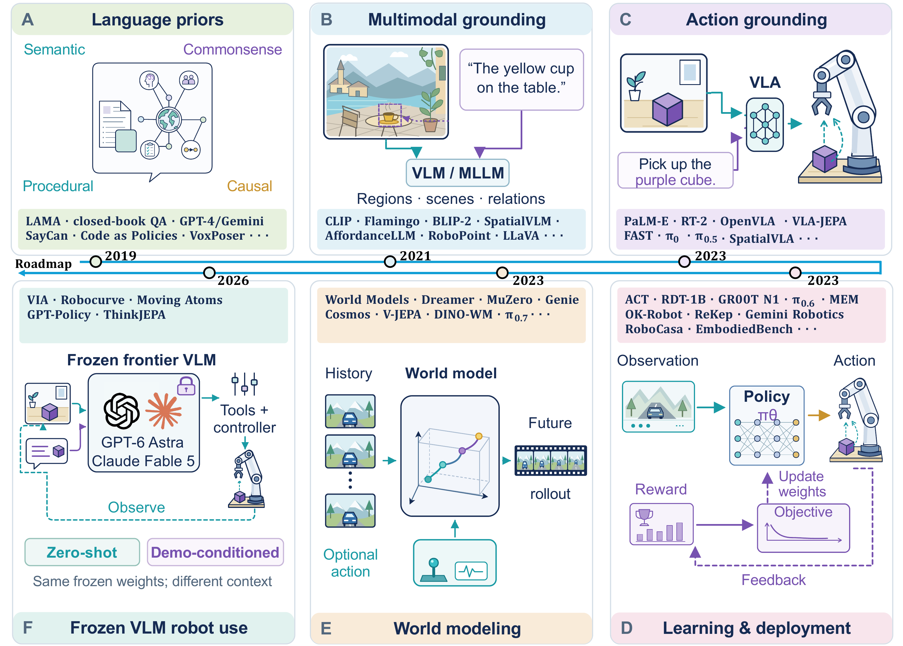

# Awesome Physical AI

## From Language Priors towards Physical AI

A survey companion on language priors, physical grounding, world models and embodied agents, with Physical AGI treated as a research objective rather than an established capability.

[**Manuscript PDF**](https://github.com/Hai-chao-Zhang/physicalAGI-Review/blob/main/output/pdf/paper.pdf) · [**LaTeX / arXiv-format source**](https://github.com/Hai-chao-Zhang/physicalAGI-Review) · [**Springer-format source**](https://github.com/Hai-chao-Zhang/AI-Review-Physical-AI-Survey) · [**Companion website**](https://physical-agi.haichaozhang.chatgpt.site) · [**All BibTeX**](bibliography/cited.bib)

**Haichao Zhang · Mingfei Chen · Shwai He · Zhengtong Xu · Yifan Shen · Yiyang Huang · Jianglin Lu · Yijiang Li · Yuhai Wang · Qihua Dong · Ang Li · Yu She · Yun Fu**

Northeastern University · University of Washington · University of Maryland, College Park · Purdue University · University of Illinois Urbana-Champaign · University of California, San Diego

**165 cited records · 8 categories · 115 with GitHub resources · 51 with Hugging Face resources · 107 with project pages**

This README lists every distinct reference used in the current manuscript, including clearly labeled reports and product documentation. The repository and linked manuscripts are working research materials; no arXiv identifier, acceptance or peer-review status is implied. The companion website is an earlier presentation snapshot; the manuscript links and catalog here are current.

## Updates

- **2026-09-19** — Synced the author-supplied Figure 1 used by both manuscript versions; the original PDF is preserved unchanged, with a high-resolution README preview.
- **2026-09-16** — Complete categorized catalog, per-paper BibTeX, and primary-source resource links; added the Astra/Fable and GPT-Policy references from Section 8.
- **2026-09-16** — Figure 1 and the text distinguish frozen compact-VLM-guided world modeling (ThinkJEPA) from frozen frontier-VLM robot-use agents.

## Contents

- [Research framework](#research-framework)
- [1. Language priors and knowledge](#priors) (15)
- [2. Vision-language grounding and physical perception](#grounding) (37)
- [3. Vision-language-action models and policy learning](#action) (26)
- [4. World models and predictive representations](#world-models) (15)
- [5. Embodied agents and system integration](#agency) (27)
- [6. Frozen VLM agents: Astra, Fable and GPT-Policy](#frontier-agents) (9)
- [7. Benchmarks, simulation and generalization](#evaluation) (30)
- [8. Surveys, perspectives and definitions](#perspectives) (6)
- [Benchmark coverage](#benchmark-coverage)
- [Citation](#citation)
- [Contributing and verification](#contributing-and-verification)

## Research framework

[](docs/assets/figure1.pdf)

[Original Figure 1 PDF](docs/assets/figure1.pdf) · [Full-resolution preview](docs/assets/figure1.png)

The PDF is copied byte-for-byte from the manuscript; the PNG above is a display rendering only. No figure content, fonts, or layout were edited.

These routes share language/vision priors and may be combined. ThinkJEPA uses a frozen compact VLM to guide a learned latent predictor; this does not make it a zero-shot robot controller. Zero-shot agents can use within-episode feedback, while supplied demonstrations and cross-episode adaptation require separate reporting.

## Complete paper and resource list

Each entry has a category and exact manuscript BibTeX, plus a paper/source link or an explicitly labeled discovery query. **—** means that no primary-source-confirmed link was located in this snapshot, not that a resource does not exist. GitHub links may provide implementations, evaluation scripts, prompts or resource collections; they do not necessarily release model weights. HF links identify official or author-linked models, datasets or collections, not generic paper-index pages. Scholar links are search aids, not citation counts or verification claims. Resource types and version cautions are recorded in the [link evidence](docs/RESOURCE-LINKS.md); inherited metadata and unresolved citation checks remain visible in the [audit catalog](docs/CATALOG.md).

<a id="priors"></a>

### 1. Language priors and knowledge

Parametric knowledge, reasoning and the language foundations of physical decision making.

| Paper / source and version | GitHub | Hugging Face | Homepage | Citation |
|---|---|---|---|---|
| <a id="paper-hu2024gptkb"></a>[Enabling LLM Knowledge Analysis via Extensive Materialization](https://aclanthology.org/2025.acl-long.791/)<br/>2025 | [Repo](https://github.com/Knowledge-aware-AI/GPTKB) | — | [Project](https://gptkb.org/) | [BibTeX](bibliography/entries/hu2024gptkb.bib) · [Scholar](https://scholar.google.com/scholar?q=%22Enabling+LLM+Knowledge+Analysis+via+Extensive+Materialization%22) |
| <a id="paper-ruis2025procedural"></a>[Procedural Knowledge in Pretraining Drives Reasoning in Large Language Models](https://arxiv.org/abs/2411.12580)<br/>2025 | — | — | — | [BibTeX](bibliography/entries/ruis2025procedural.bib) · [Scholar](https://scholar.google.com/scholar?q=%22Procedural+Knowledge+in+Pretraining+Drives+Reasoning+in+Large+Language+Models%22) |
| <a id="paper-anthropic2024claude35sonnettool"></a>[Claude 3.5 Sonnet Model Card Addendum](https://www.anthropic.com/news/claude-3-5-sonnet)<br/>2024 · **Documentation / report** | — | — | [Project](https://www.anthropic.com/news/claude-3-5-sonnet) | [BibTeX](bibliography/entries/anthropic2024claude35sonnettool.bib) · [Scholar](https://scholar.google.com/scholar?q=%22Claude+3.5+Sonnet+Model+Card+Addendum%22) |
| <a id="paper-chang2024factualpretraining"></a>[How Do Large Language Models Acquire Factual Knowledge During Pretraining?](https://proceedings.neurips.cc/paper_files/paper/2024/hash/6fdf57c71bc1f1ee29014b8dc52e723f-Abstract-Conference.html)<br/>2024 | [Repo](https://github.com/kaistAI/factual-knowledge-acquisition) | [HF](https://huggingface.co/datasets/kaist-ai/fictional-knowledge) | — | [BibTeX](bibliography/entries/chang2024factualpretraining.bib) · [Scholar](https://scholar.google.com/scholar?q=%22How+Do+Large+Language+Models+Acquire+Factual+Knowledge+During+Pretraining%3F%22) |
| <a id="paper-tao2024context"></a>[When Context Leads but Parametric Memory Follows in Large Language Models](https://aclanthology.org/2024.emnlp-main.234/)<br/>2024 | [Repo](https://github.com/PortNLP/WikiAtomic) | — | — | [BibTeX](bibliography/entries/tao2024context.bib) · [Scholar](https://scholar.google.com/scholar?q=%22When+Context+Leads+but+Parametric+Memory+Follows+in+Large+Language+Models%22) |
| <a id="paper-geva2023dissecting"></a>[Dissecting Recall of Factual Associations in Auto-Regressive Language Models](https://aclanthology.org/2023.emnlp-main.751/)<br/>2023 | [Repo](https://github.com/google-research/google-research/tree/master/dissecting_factual_predictions) | — | — | [BibTeX](bibliography/entries/geva2023dissecting.bib) · [Scholar](https://scholar.google.com/scholar?q=%22Dissecting+Recall+of+Factual+Associations+in+Auto-Regressive+Language+Models%22) |
| <a id="paper-openai2023gpt4"></a>[Gpt-4 technical report](https://arxiv.org/abs/2303.08774)<br/>2023 | — | — | [Project](https://openai.com/index/gpt-4-research/) | [BibTeX](bibliography/entries/openai2023gpt4.bib) · [Scholar](https://scholar.google.com/scholar?q=%22Gpt-4+technical+report%22) |
| <a id="paper-kandpal2023longtail"></a>[Large Language Models Struggle to Learn Long-Tail Knowledge](https://proceedings.mlr.press/v202/kandpal23a.html)<br/>2023 · ICML | [Repo](https://github.com/nkandpa2/long_tail_knowledge) | [HF 1](https://huggingface.co/datasets/nkandpa2/pretraining_entities) · [HF 2](https://huggingface.co/datasets/nkandpa2/qa_entities) | — | [BibTeX](bibliography/entries/kandpal2023longtail.bib) · [Scholar](https://scholar.google.com/scholar?q=%22Large+Language+Models+Struggle+to+Learn+Long-Tail+Knowledge%22) |
| <a id="paper-wei2022chain"></a>[Chain-of-thought prompting elicits reasoning in large language models](https://proceedings.neurips.cc/paper_files/paper/2022/hash/9d5609613524ecf4f15af0f7b31abca4-Abstract-Conference.html)<br/>2022 | [Repo](https://github.com/jasonwei20/chain-of-thought-prompting) | — | [Project](https://research.google/blog/language-models-perform-reasoning-via-chain-of-thought/) | [BibTeX](bibliography/entries/wei2022chain.bib) · [Scholar](https://scholar.google.com/scholar?q=%22Chain-of-thought+prompting+elicits+reasoning+in+large+language+models%22) |
| <a id="paper-bommasani2021foundation"></a>[On the Opportunities and Risks of Foundation Models](https://arxiv.org/abs/2108.07258)<br/>2021 | — | — | [Project](https://crfm.stanford.edu/report) | [BibTeX](bibliography/entries/bommasani2021foundation.bib) · [Scholar](https://scholar.google.com/scholar?q=%22On+the+Opportunities+and+Risks+of+Foundation+Models%22) |
| <a id="paper-roberts2020knowledge"></a>[How Much Knowledge Can You Pack Into the Parameters of a Language Model?](https://aclanthology.org/2020.emnlp-main.437/)<br/>2020 | [Repo](https://github.com/google-research/google-research/tree/master/t5_closed_book_qa) | — | — | [BibTeX](bibliography/entries/roberts2020knowledge.bib) · [Scholar](https://scholar.google.com/scholar?q=%22How+Much+Knowledge+Can+You+Pack+Into+the+Parameters+of+a+Language+Model%3F%22) |
| <a id="paper-brown2020language"></a>[Language Models are Few-Shot Learners](https://proceedings.neurips.cc/paper_files/paper/2020/hash/1457c0d6bfcb4967418bfb8ac142f64a-Abstract.html)<br/>2020 · NeurIPS | [Repo](https://github.com/openai/gpt-3) | — | — | [BibTeX](bibliography/entries/brown2020language.bib) · [Scholar](https://scholar.google.com/scholar?q=%22Language+models+are+few-shot+learners%22) |
| <a id="paper-petroni2019language"></a>[Language Models as Knowledge Bases?](https://aclanthology.org/D19-1250/)<br/>2019 · EMNLP-IJCNLP | [Repo](https://github.com/facebookresearch/LAMA) | — | — | [BibTeX](bibliography/entries/petroni2019language.bib) · [Scholar](https://scholar.google.com/scholar?q=%22Language+Models+as+Knowledge+Bases%3F%22) |
| <a id="paper-hagoort2004integration"></a>[Integration of word meaning and world knowledge in language comprehension](https://doi.org/10.1126/science.1095455)<br/>2004 | — | — | — | [BibTeX](bibliography/entries/hagoort2004integration.bib) · [Scholar](https://scholar.google.com/scholar?q=%22Integration+of+word+meaning+and+world+knowledge+in+language+comprehension%22) |
| <a id="paper-arkin1990integrating"></a>[Integrating behavioral, perceptual, and world knowledge in reactive navigation](https://sciencedirect.com/science/article/pii/S0921889005800314)<br/>1990 | — | — | — | [BibTeX](bibliography/entries/arkin1990integrating.bib) · [Scholar](https://scholar.google.com/scholar?q=%22Integrating+behavioral%2C+perceptual%2C+and+world+knowledge+in+reactive+navigation%22) |

<a id="grounding"></a>

### 2. Vision-language grounding and physical perception

Spatial, temporal and affordance representations that connect language to observations.

| Paper / source and version | GitHub | Hugging Face | Homepage | Citation |
|---|---|---|---|---|
| <a id="paper-shen2026chronovision"></a>[ChronoVision: Temporal Reasoning via Latent State Reconstruction](https://arxiv.org/abs/2608.05631)<br/>2026 | [Repo](https://github.com/PediaMedAI/Cognition-MLLM) | — | [Project](https://pediamedai.com/Cognition-MLLM/ChronoVision/) | [BibTeX](bibliography/entries/shen2026chronovision.bib) · [Scholar](https://scholar.google.com/scholar?q=%22ChronoVision%3A+Temporal+Reasoning+via+Latent+State+Reconstruction%22) |
| <a id="paper-shen2026cogniroute"></a>[CogniRoute: Learning to Route Social Evidence in Omni-Modal Models](https://arxiv.org/abs/2606.20970)<br/>2026 | — | — | — | [BibTeX](bibliography/entries/shen2026cogniroute.bib) · [Scholar](https://scholar.google.com/scholar?q=%22CogniRoute%3A+Learning+to+Route+Social+Evidence+in+Omni-Modal+Models%22) |
| <a id="paper-shen2026fine"></a>[Fine-grained preference optimization improves spatial reasoning in vlms](https://proceedings.neurips.cc/paper_files/paper/2025/hash/1a17a06de88cf77f25cda0da91615a54-Abstract-Conference.html)<br/>2026 | [Repo](https://github.com/PLAN-Lab/SpatialReasonerR1) | [HF](https://huggingface.co/PLAN-Lab/SpatialReasoner-R1) | — | [BibTeX](bibliography/entries/shen2026fine.bib) · [Scholar](https://scholar.google.com/scholar?q=%22Fine-grained+preference+optimization+improves+spatial+reasoning+in+vlms%22) |
| <a id="paper-wang2026finemola"></a>[FineMoLA: Towards Fine-Grained Motion-Language Alignment from Clip-Level Supervision](https://openaccess.thecvf.com/content/CVPR2026W/HuMoGen/html/Wang_FineMoLA_Towards_Fine-Grained_Motion-Language_Alignment_from_Clip-Level_Supervision_CVPRW_2026_paper.html)<br/>2026 | — | — | [Project](https://hellosunnyworld.github.io/finemola/) | [BibTeX](bibliography/entries/wang2026finemola.bib) · [Scholar](https://scholar.google.com/scholar?q=%22FineMoLA%3A+Towards+Fine-Grained+Motion-Language+Alignment+from+Clip-Level+Supervision%22) |
| <a id="paper-team2026qwen3"></a>[Qwen3. 5-omni technical report](https://arxiv.org/abs/2604.15804)<br/>2026 | — | — | [Project](https://huggingface.co/spaces/Qwen/Qwen3.5-Omni-Online-Demo) | [BibTeX](bibliography/entries/team2026qwen3.bib) · [Scholar](https://scholar.google.com/scholar?q=%22Qwen3.+5-omni+technical+report%22) |
| <a id="paper-li2026toward"></a>[Toward cognitive supersensing in multimodal large language model](https://arxiv.org/abs/2602.01541)<br/>2026 | [Repo](https://github.com/PediaMedAI/Cognition-MLLM) | [HF 1](https://huggingface.co/datasets/PediaMedAI/CogSense-Bench) · [HF 2](https://huggingface.co/PediaMedAI/CogSense-8B) | [Project](https://pediamedai.com/Cognition-MLLM/cogsense/) | [BibTeX](bibliography/entries/li2026toward.bib) · [Scholar](https://scholar.google.com/scholar?q=%22Toward+cognitive+supersensing+in+multimodal+large+language+model%22) |
| <a id="paper-zhang2026vqtoken"></a>[Vqtoken: Neural discrete token representation learning for extreme token reduction in video large language models](https://proceedings.neurips.cc/paper_files/paper/2025/hash/2f4d6f8e0f4f543db12260696b2a3551-Abstract-Conference.html)<br/>2026 | [Repo](https://github.com/Hai-chao-Zhang/VQToken) | [HF](https://huggingface.co/haichaozhang/VQ-Token-llava-ov-0.5b) | — | [BibTeX](bibliography/entries/zhang2026vqtoken.bib) · [Scholar](https://scholar.google.com/scholar?q=%22Vqtoken%3A+Neural+discrete+token+representation+learning+for+extreme+token+reduction+in+video+large+language+models%22) |
| <a id="paper-chu2025threedaffordancellm"></a>[3D-AffordanceLLM: Harnessing Large Language Models for Open-Vocabulary Affordance Detection in 3D Worlds](https://proceedings.iclr.cc/paper_files/paper/2025/hash/b364c8cbb3f229f40d5873e877391bd2-Abstract-Conference.html)<br/>2025 | [Repo](https://github.com/iLearn-Lab/ICLR25-3D_ADLLM) | — | — | [BibTeX](bibliography/entries/chu2025threedaffordancellm.bib) · [Scholar](https://scholar.google.com/scholar?q=%223D-AffordanceLLM%3A+Harnessing+Large+Language+Models+for+Open-Vocabulary+Affordance+Detection+in+3D+Worlds%22) |
| <a id="paper-zhang2025dense"></a>[Dense video understanding with gated residual tokenization](https://arxiv.org/abs/2509.14199)<br/>2025 | [Repo](https://github.com/hai-chao-zhang/DenseVideoUnderstand/) | [HF](https://huggingface.co/datasets/haichaozhang/DenseVideoEvaluation) | — | [BibTeX](bibliography/entries/zhang2025dense.bib) · [Scholar](https://scholar.google.com/scholar?q=%22Dense+video+understanding+with+gated+residual+tokenization%22) |
| <a id="paper-zhang2025linkedout"></a>[LinkedOut: Linking World Knowledge Representation Out of Video LLM for Next-Generation Video Recommendation](https://arxiv.org/abs/2512.16891)<br/>2025 | — | — | — | [BibTeX](bibliography/entries/zhang2025linkedout.bib) · [Scholar](https://scholar.google.com/scholar?q=%22LinkedOut%3A+Linking+World+Knowledge+Representation+Out+of+Video+LLM+for+Next-Generation+Video+Recommendation%22) |
| <a id="paper-wu2025mass"></a>[MASS: Motion-Aware Spatial-Temporal Grounding for Physics Reasoning and Comprehension in Vision-Language Models](https://arxiv.org/abs/2511.18373)<br/>2025 | — | — | — | [BibTeX](bibliography/entries/wu2025mass.bib) · [Scholar](https://scholar.google.com/scholar?q=%22MASS%3A+Motion-Aware+Spatial-Temporal+Grounding+for+Physics+Reasoning+and+Comprehension+in+Vision-Language+Models%22) |
| <a id="paper-deitke2025molmo"></a>[Molmo and pixmo: Open weights and open data for state-of-the-art vision-language models](https://ieeexplore.ieee.org/abstract/document/11092508/)<br/>2025 | [Repo](https://github.com/allenai/molmo) | [HF 1](https://huggingface.co/collections/allenai/molmo-66f379e6fe3b8ef090a8ca19) · [HF 2](https://huggingface.co/collections/allenai/pixmo-674746ea613028006285687b) | — | [BibTeX](bibliography/entries/deitke2025molmo.bib) · [Scholar](https://scholar.google.com/scholar?q=%22Molmo+and+pixmo%3A+Open+weights+and+open+data+for+state-of-the-art+vision-language+models%22) |
| <a id="paper-liu2025pavlm"></a>[PAVLM: Advancing point cloud based affordance understanding via vision-language model](https://arxiv.org/abs/2410.11564)<br/>2025 | — | — | [Project](https://pavlm-source.github.io/) | [BibTeX](bibliography/entries/liu2025pavlm.bib) · [Scholar](https://scholar.google.com/scholar?q=%22PAVLM%3A+Advancing+point+cloud+based+affordance+understanding+via+vision-language+model%22) |
| <a id="paper-yuan2024robopoint"></a>[RoboPoint: A Vision-Language Model for Spatial Affordance Prediction in Robotics](https://proceedings.mlr.press/v270/yuan25c.html)<br/>2025 | [Repo](https://github.com/wentaoyuan/RoboPoint) | [HF 1](https://huggingface.co/wentao-yuan/robopoint-v1-vicuna-v1.5-13b) · [HF 2](https://huggingface.co/datasets/wentao-yuan/robopoint_data) · [HF 3](https://huggingface.co/datasets/wentao-yuan/where2place) | [Project](https://robo-point.github.io) | [BibTeX](bibliography/entries/yuan2024robopoint.bib) · [Scholar](https://scholar.google.com/scholar?q=%22RoboPoint%3A+A+Vision-Language+Model+for+Spatial+Affordance+Prediction+in+Robotics%22) |
| <a id="paper-song2025robospatial"></a>[Robospatial: Teaching spatial understanding to 2d and 3d vision-language models for robotics](https://openaccess.thecvf.com/content/CVPR2025/html/Song_RoboSpatial_Teaching_Spatial_Understanding_to_2D_and_3D_Vision-Language_Models_CVPR_2025_paper.html)<br/>2025 | [Repo](https://github.com/NVlabs/RoboSpatial) | [HF](https://huggingface.co/datasets/chanhee-luke/RoboSpatial-Home) | — | [BibTeX](bibliography/entries/song2025robospatial.bib) · [Scholar](https://scholar.google.com/scholar?q=%22Robospatial%3A+Teaching+spatial+understanding+to+2d+and+3d+vision-language+models+for+robotics%22) |
| <a id="paper-zeng2025timesuite"></a>[Timesuite: Improving mllms for long video understanding via grounded tuning](https://arxiv.org/abs/2410.19702)<br/>2025 | [Repo](https://github.com/OpenGVLab/TimeSuite) | [HF](https://huggingface.co/Lanxingxuan/TimeSuite) | — | [BibTeX](bibliography/entries/zeng2025timesuite.bib) · [Scholar](https://scholar.google.com/scholar?q=%22Timesuite%3A+Improving+mllms+for+long+video+understanding+via+grounded+tuning%22) |
| <a id="paper-munasinghe2025videoglamm"></a>[Videoglamm: A large multimodal model for pixel-level visual grounding in videos](https://ieeexplore.ieee.org/abstract/document/11093431/)<br/>2025 | [Repo](https://github.com/mbzuai-oryx/VideoGLaMM) | — | [Project](https://mbzuai-oryx.github.io/VideoGLaMM/) | [BibTeX](bibliography/entries/munasinghe2025videoglamm.bib) · [Scholar](https://scholar.google.com/scholar?q=%22Videoglamm%3A+A+large+multimodal+model+for+pixel-level+visual+grounding+in+videos%22) |
| <a id="paper-guo2025vtg"></a>[Vtg-llm: Integrating timestamp knowledge into video llms for enhanced video temporal grounding](https://arxiv.org/abs/2405.13382)<br/>2025 | [Repo](https://github.com/gyxxyg/VTG-LLM) | [HF 1](https://huggingface.co/Yongxin-Guo/VTG-LLM) · [HF 2](https://huggingface.co/datasets/Yongxin-Guo/VTG-IT) | — | [BibTeX](bibliography/entries/guo2025vtg.bib) · [Scholar](https://scholar.google.com/scholar?q=%22Vtg-llm%3A+Integrating+timestamp+knowledge+into+video+llms+for+enhanced+video+temporal+grounding%22) |
| <a id="paper-qian2024affordancellm"></a>[AffordanceLLM: Grounding Affordance from Vision Language Models](https://ieeexplore.ieee.org/abstract/document/10678001/)<br/>2024 | [Repo](https://github.com/JasonQSY/AffordanceLLM) | — | — | [BibTeX](bibliography/entries/qian2024affordancellm.bib) · [Scholar](https://scholar.google.com/scholar?q=%22AffordanceLLM%3A+Grounding+Affordance+from+Vision+Language+Models%22) |
| <a id="paper-xiao2024florence"></a>[Florence-2: Advancing a unified representation for a variety of vision tasks](https://arxiv.org/abs/2311.06242)<br/>2024 | — | [HF](https://huggingface.co/microsoft/Florence-2-base) | — | [BibTeX](bibliography/entries/xiao2024florence.bib) · [Scholar](https://scholar.google.com/scholar?q=%22Florence-2%3A+Advancing+a+unified+representation+for+a+variety+of+vision+tasks%22) |
| <a id="paper-rasheed2024glammpixelgroundinglarge"></a>[GLaMM: Pixel Grounding Large Multimodal Model](https://ieeexplore.ieee.org/abstract/document/10655326/)<br/>2024 | [Repo](https://github.com/mbzuai-oryx/groundingLMM) | — | [Project](https://mbzuai-oryx.github.io/groundingLMM) | [BibTeX](bibliography/entries/rasheed2024glammpixelgroundinglarge.bib) · [Scholar](https://scholar.google.com/scholar?q=%22GLaMM%3A+Pixel+Grounding+Large+Multimodal+Model%22) |
| <a id="paper-wang2024grounded"></a>[Grounded-videollm: Sharpening fine-grained temporal grounding in video large language models](https://arxiv.org/abs/2410.03290)<br/>2024 | [Repo](https://github.com/WHB139426/Grounded-Video-LLM) | [HF 1](https://huggingface.co/WHB139426/Grounded-Video-LLM) · [HF 2](https://huggingface.co/datasets/WHB139426/Grounded-VideoLLM/blob/main/G-VideoQA-gpt4o-mini-anno.json) | — | [BibTeX](bibliography/entries/wang2024grounded.bib) · [Scholar](https://scholar.google.com/scholar?q=%22Grounded-videollm%3A+Sharpening+fine-grained+temporal+grounding+in+video+large+language+models%22) |
| <a id="paper-lai2024lisa"></a>[Lisa: Reasoning segmentation via large language model](https://ieeexplore.ieee.org/abstract/document/10658574/)<br/>2024 | [Repo](https://github.com/JIA-Lab-research/LISA) | [HF](https://huggingface.co/xinlai/LISA-7B-v1) | — | [BibTeX](bibliography/entries/lai2024lisa.bib) · [Scholar](https://scholar.google.com/scholar?q=%22LISA%3A+Reasoning+Segmentation+via+Large+Language+Model%22) |
| <a id="paper-huang2024manipvqa"></a>[ManipVQA: Injecting Robotic Affordance and Physically Grounded Information into Multi-Modal Large Language Models](https://ieeexplore.ieee.org/abstract/document/10801993/)<br/>2024 | [Repo](https://github.com/SiyuanHuang95/ManipVQA) | [HF 1](https://huggingface.co/SiyuanH/ManipVQA/tree/main) · [HF 2](https://huggingface.co/SiyuanH/ManipVQA-7B) | — | [BibTeX](bibliography/entries/huang2024manipvqa.bib) · [Scholar](https://scholar.google.com/scholar?q=%22ManipVQA%3A+Injecting+Robotic+Affordance+and+Physically+Grounded+Information+into+Multi-Modal+Large+Language+Models%22) |
| <a id="paper-chen2024spatialvlm"></a>[SpatialVLM: Endowing Vision-Language Models with Spatial Reasoning Capabilities](https://arxiv.org/abs/2401.12168)<br/>2024 · arXiv | — | — | [Project](https://spatial-vlm.github.io/) | [BibTeX](bibliography/entries/chen2024spatialvlm.bib) · [Scholar](https://scholar.google.com/scholar?q=%22SpatialVLM%3A+Endowing+Vision-Language+Models+with+Spatial+Reasoning+Capabilities%22) |
| <a id="paper-ren2024timechat"></a>[Timechat: A time-sensitive multimodal large language model for long video understanding](https://ieeexplore.ieee.org/abstract/document/10656135/)<br/>2024 | [Repo](https://github.com/RenShuhuai-Andy/TimeChat) | [HF 1](https://huggingface.co/ShuhuaiRen/TimeChat-7b) · [HF 2](https://huggingface.co/datasets/ShuhuaiRen/TimeIT) | — | [BibTeX](bibliography/entries/ren2024timechat.bib) · [Scholar](https://scholar.google.com/scholar?q=%22Timechat%3A+A+time-sensitive+multimodal+large+language+model+for+long+video+understanding%22) |
| <a id="paper-li2023blip"></a>[Blip-2: Bootstrapping language-image pre-training with frozen image encoders and large language models](https://proceedings.mlr.press/v202/li23q)<br/>2023 | [Repo](https://github.com/salesforce/LAVIS/tree/main/projects/blip2) | [HF](https://huggingface.co/Salesforce/blip2-opt-2.7b) | — | [BibTeX](bibliography/entries/li2023blip.bib) · [Scholar](https://scholar.google.com/scholar?q=%22BLIP-2%3A+Bootstrapping+Language-Image+Pre-training+with+Frozen+Image+Encoders+and+Large+Language+Models%22) |
| <a id="paper-team2023gemini"></a>[Gemini: a family of highly capable multimodal models](https://arxiv.org/abs/2312.11805)<br/>2023 | — | — | [Project](https://blog.google/innovation-and-ai/technology/ai/google-gemini-ai/) | [BibTeX](bibliography/entries/team2023gemini.bib) · [Scholar](https://scholar.google.com/scholar?q=%22Gemini%3A+a+family+of+highly+capable+multimodal+models%22) |
| <a id="paper-driess2023palm"></a>[PaLM-E: An Embodied Multimodal Language Model](https://proceedings.mlr.press/v202/driess23a.html)<br/>2023 · ICML | — | — | [Project](https://palm-e.github.io/) | [BibTeX](bibliography/entries/driess2023palm.bib) · [Scholar](https://scholar.google.com/scholar?q=%22PaLM-E%3A+an+embodied+multimodal+language+model%22) |
| <a id="paper-liu2023llava"></a>[Visual instruction tuning](https://proceedings.neurips.cc/paper_files/paper/2023/hash/6dcf277ea32ce3288914faf369fe6de0-Abstract-Conference.html)<br/>2023 | [Repo](https://github.com/haotian-liu/LLaVA) | [HF 1](https://huggingface.co/datasets/liuhaotian/LLaVA-Pretrain) · [HF 2](https://huggingface.co/datasets/liuhaotian/LLaVA-Instruct-150K) | [Project](https://llava-vl.github.io/) | [BibTeX](bibliography/entries/liu2023llava.bib) · [Scholar](https://scholar.google.com/scholar?q=%22Visual+instruction+tuning%22) |
| <a id="paper-schwenk2022okvqa"></a>[A-okvqa: A benchmark for visual question answering using world knowledge](https://arxiv.org/abs/2206.01718)<br/>2022 | [Repo](https://github.com/allenai/aokvqa) | — | — | [BibTeX](bibliography/entries/schwenk2022okvqa.bib) · [Scholar](https://scholar.google.com/scholar?q=%22A-okvqa%3A+A+benchmark+for+visual+question+answering+using+world+knowledge%22) |
| <a id="paper-shridhar2022cliport"></a>[Cliport: What and where pathways for robotic manipulation](https://arxiv.org/abs/2109.12098)<br/>2022 | [Repo](https://github.com/cliport/cliport) | — | [Project](https://cliport.github.io) | [BibTeX](bibliography/entries/shridhar2022cliport.bib) · [Scholar](https://scholar.google.com/scholar?q=%22Cliport%3A+What+and+where+pathways+for+robotic+manipulation%22) |
| <a id="paper-alayrac2022flamingo"></a>[Flamingo: a visual language model for few-shot learning](https://proceedings.neurips.cc/paper_files/paper/2022/hash/960a172bc7fbf0177ccccbb411a7d800-Abstract-Conference.html)<br/>2022 | — | — | [Project](https://deepmind.google/blog/tackling-multiple-tasks-with-a-single-visual-language-model/) | [BibTeX](bibliography/entries/alayrac2022flamingo.bib) · [Scholar](https://scholar.google.com/scholar?q=%22Flamingo%3A+a+visual+language+model+for+few-shot+learning%22) |
| <a id="paper-radford2021learning"></a>[Learning Transferable Visual Models From Natural Language Supervision](https://proceedings.mlr.press/v139/radford21a.html)<br/>2021 · ICML | [Repo](https://github.com/openai/CLIP) | — | [Project](https://openai.com/index/clip/) | [BibTeX](bibliography/entries/radford2021learning.bib) · [Scholar](https://scholar.google.com/scholar?q=%22Learning+transferable+visual+models+from+natural+language+supervision%22) |
| <a id="paper-jia2021align"></a>[Scaling up visual and vision-language representation learning with noisy text supervision](https://proceedings.mlr.press/v139/jia21b.html)<br/>2021 | — | — | [Project](https://research.google/blog/align-scaling-up-visual-and-vision-language-representation-learning-with-noisy-text-supervision/) | [BibTeX](bibliography/entries/jia2021align.bib) · [Scholar](https://scholar.google.com/scholar?q=%22Scaling+up+visual+and+vision-language+representation+learning+with+noisy+text+supervision%22) |
| <a id="paper-tan2019lxmert"></a>[Lxmert: Learning cross-modality encoder representations from transformers](https://arxiv.org/abs/1908.07490)<br/>2019 | [Repo](https://github.com/airsplay/lxmert) | — | — | [BibTeX](bibliography/entries/tan2019lxmert.bib) · [Scholar](https://scholar.google.com/scholar?q=%22Lxmert%3A+Learning+cross-modality+encoder+representations+from+transformers%22) |
| <a id="paper-lu2019vilbert"></a>[Vilbert: Pretraining task-agnostic visiolinguistic representations for vision-and-language tasks](https://proceedings.neurips.cc/paper_files/paper/2019/hash/c74d97b01eae257e44aa9d5bade97baf-Abstract.html)<br/>2019 | [Repo](https://github.com/jiasenlu/vilbert_beta) | — | — | [BibTeX](bibliography/entries/lu2019vilbert.bib) · [Scholar](https://scholar.google.com/scholar?q=%22Vilbert%3A+Pretraining+task-agnostic+visiolinguistic+representations+for+vision-and-language+tasks%22) |

<a id="action"></a>

### 3. Vision-language-action models and policy learning

Action representations, robot learning, demonstrations and generalist policies.

| Paper / source and version | GitHub | Hugging Face | Homepage | Citation |
|---|---|---|---|---|
| <a id="paper-torne2026mem"></a>[MEM: Multi-Scale Embodied Memory for Vision Language Action Models](https://arxiv.org/abs/2603.03596)<br/>2026 | — | — | [Project](https://www.pi.website/research/memory) | [BibTeX](bibliography/entries/torne2026mem.bib) · [Scholar](https://scholar.google.com/scholar?q=%22MEM%3A+Multi-Scale+Embodied+Memory+for+Vision+Language+Action+Models%22) |
| <a id="paper-fang2026molmoact2"></a>[MolmoAct2: Action Reasoning Models for Real-world Deployment](https://arxiv.org/abs/2605.02881)<br/>2026 | [Repo](https://github.com/allenai/molmoact2) | [HF 1](https://huggingface.co/collections/allenai/molmoact2-models-69f81e05242e2499606b1be6) · [HF 2](https://huggingface.co/collections/allenai/molmoact2-datasets-69f81e316ec3daafe3f9555c) | [Project](https://allenai.org/blog/molmoact2) | [BibTeX](bibliography/entries/fang2026molmoact2.bib) · [Scholar](https://scholar.google.com/scholar?q=%22MolmoAct2%3A+Action+Reasoning+Models+for+Real-world+Deployment%22) |
| <a id="paper-liu2026palm"></a>[PALM: Progress-Aware Policy Learning via Affordance Reasoning for Long-Horizon Robotic Manipulation](https://arxiv.org/abs/2601.07060)<br/>2026 | — | — | — | [BibTeX](bibliography/entries/liu2026palm.bib) · [Scholar](https://scholar.google.com/scholar?q=%22PALM%3A+Progress-Aware+Policy+Learning+via+Affordance+Reasoning+for+Long-Horizon+Robotic+Manipulation%22) |
| <a id="paper-ye2026starvla"></a>[StarVLA-α: Reducing Complexity in Vision Language Action Systems](https://arxiv.org/abs/2604.11757)<br/>2026 | [Repo](https://github.com/starVLA/starVLA) | [HF 1](https://huggingface.co/StarVLA/Qwen2.5-VL-3B-Instruct-Action) · [HF 2](https://huggingface.co/StarVLA/Qwen3-VL-4B-Instruct-Action) · [HF 3](https://huggingface.co/StarVLA/Qwen3VL-GR00T-Bridge-RT-1) | [Project](https://starvla.github.io/) | [BibTeX](bibliography/entries/ye2026starvla.bib) · [Scholar](https://scholar.google.com/scholar?q=%22StarVLA-%CE%B1%3A+Reducing+Complexity+in+Vision+Language+Action+Systems%22) |
| <a id="paper-gao2026vla"></a>[Vla-os: Structuring and dissecting planning representations and paradigms in vision-language-action models](https://proceedings.neurips.cc/paper_files/paper/2025/hash/c7af751b5e0a407c62ac023e3cb381f9-Abstract-Conference.html)<br/>2026 | [Repo](https://github.com/HeegerGao/VLA-OS) | [HF 1](https://huggingface.co/Linslab/VLA-OS) · [HF 2](https://huggingface.co/datasets/Linslab/VLA-OS-Dataset) | [Project](https://nus-lins-lab.github.io/vlaos/) | [BibTeX](bibliography/entries/gao2026vla.bib) · [Scholar](https://scholar.google.com/scholar?q=%22Vla-os%3A+Structuring+and+dissecting+planning+representations+and+paradigms+in+vision-language-action+models%22) |
| <a id="paper-zhang2026vlm4vla"></a>[VLM4VLA: Revisiting Vision-Language-Models in Vision-Language-Action Models](https://arxiv.org/abs/2601.03309)<br/>2026 | [Repo](https://github.com/CladernyJorn/VLM4VLA) | — | [Project](https://cladernyjorn.github.io/VLM4VLA.github.io/) | [BibTeX](bibliography/entries/zhang2026vlm4vla.bib) · [Scholar](https://scholar.google.com/scholar?q=%22VLM4VLA%3A+Revisiting+Vision-Language-Models+in+Vision-Language-Action+Models%22) |
| <a id="paper-cai2026xiaomi"></a>[Xiaomi-Robotics-0: An Open-Sourced Vision-Language-Action Model with Real-Time Execution](https://arxiv.org/abs/2602.12684)<br/>2026 | [Repo](https://github.com/XiaomiRobotics/Xiaomi-Robotics-0) | [HF](https://huggingface.co/collections/XiaomiRobotics/xiaomi-robotics-0) | [Project](https://xiaomi-robotics-0.github.io/) | [BibTeX](bibliography/entries/cai2026xiaomi.bib) · [Scholar](https://scholar.google.com/scholar?q=%22Xiaomi-Robotics-0%3A+An+Open-Sourced+Vision-Language-Action+Model+with+Real-Time+Execution%22) |
| <a id="paper-intelligence2026pi"></a>[π₀.₇: a Steerable Generalist Robotic Foundation Model with Emergent Capabilities](https://arxiv.org/abs/2604.15483)<br/>2026 | — | — | [Project](https://www.pi.website/blog/pi07) | [BibTeX](bibliography/entries/intelligence2026pi.bib) · [Scholar](https://scholar.google.com/scholar?q=%22%CF%800.7%3A+a+Steerable+Generalist+Robotic+Foundation+Model+with+Emergent+Capabilities%22) |
| <a id="paper-gong2025anytask"></a>[AnyTask: an Automated Task and Data Generation Framework for Advancing Sim-to-Real Policy Learning](https://arxiv.org/abs/2512.17853)<br/>2025 | — | — | [Project](https://anytask.rai-inst.com/) | [BibTeX](bibliography/entries/gong2025anytask.bib) · [Scholar](https://scholar.google.com/scholar?q=%22AnyTask%3A+an+Automated+Task+and+Data+Generation+Framework+for+Advancing+Sim-to-Real+Policy+Learning%22) |
| <a id="paper-wen2025dexvla"></a>[DexVLA: Vision-language model with plug-in diffusion expert for general robot control](https://arxiv.org/abs/2502.05855)<br/>2025 | [Repo](https://github.com/midea-ai/DexVLA) | [HF 1](https://huggingface.co/datasets/lesjie/dexvla_example_data) · [HF 2](https://huggingface.co/lesjie/scale_dp_h) · [HF 3](https://huggingface.co/lesjie/scale_dp_l) | [Project](https://dex-vla.github.io/) | [BibTeX](bibliography/entries/wen2025dexvla.bib) · [Scholar](https://scholar.google.com/scholar?q=%22DexVLA%3A+Vision-language+model+with+plug-in+diffusion+expert+for+general+robot+control%22) |
| <a id="paper-pertsch2025fast"></a>[FAST: Efficient action tokenization for vision-language-action models](https://arxiv.org/abs/2501.09747)<br/>2025 | [Repo](https://github.com/Physical-Intelligence/openpi) | [HF](https://huggingface.co/physical-intelligence/fast) | [Project](https://www.pi.website/research/fast) | [BibTeX](bibliography/entries/pertsch2025fast.bib) · [Scholar](https://scholar.google.com/scholar?q=%22FAST%3A+Efficient+action+tokenization+for+vision-language-action+models%22) |
| <a id="paper-hua2024gensim2"></a>[GenSim2: Scaling Robot Data Generation with Multi-modal and Reasoning LLMs](https://proceedings.mlr.press/v270/hua25a.html)<br/>2025 | [Repo](https://github.com/GenSim2/GenSim2) | — | [Project](https://gensim2.github.io/) | [BibTeX](bibliography/entries/hua2024gensim2.bib) · [Scholar](https://scholar.google.com/scholar?q=%22GenSim2%3A+Scaling+Robot+Data+Generation+with+Multi-modal+and+Reasoning+LLMs%22) |
| <a id="paper-bjorck2025gr00tn1"></a>[GR00T N1: An Open Foundation Model for Generalist Humanoid Robots](https://arxiv.org/abs/2503.14734)<br/>2025 | [Repo](https://github.com/NVIDIA/Isaac-GR00T) | [HF](https://huggingface.co/nvidia/GR00T-N1-2B) | [Project](https://research.nvidia.com/labs/lpr/publication/gr00tn1_2025/) | [BibTeX](bibliography/entries/bjorck2025gr00tn1.bib) · [Scholar](https://scholar.google.com/scholar?q=%22GR00T+N1%3A+An+Open+Foundation+Model+for+Generalist+Humanoid+Robots%22) |
| <a id="paper-kim2024openvla"></a>[OpenVLA: An Open-Source Vision-Language-Action Model](https://proceedings.mlr.press/v270/kim25c.html)<br/>2025 · PMLR; preprint 2024 | [Repo](https://github.com/openvla/openvla) | [HF](https://huggingface.co/openvla/openvla-7b) | [Project](https://openvla.github.io/) | [BibTeX](bibliography/entries/kim2024openvla.bib) · [Scholar](https://scholar.google.com/scholar?q=%22OpenVLA%3A+An+Open-Source+Vision-Language-Action+Model%22) |
| <a id="paper-rdt1b2025"></a>[RDT-1B: a Diffusion Foundation Model for Bimanual Manipulation](https://proceedings.iclr.cc/paper_files/paper/2025/hash/49f80e4d2471ad4f2edf4f5f1ab62339-Abstract-Conference.html)<br/>2025 | [Repo](https://github.com/thu-ml/RoboticsDiffusionTransformer) | [HF 1](https://huggingface.co/robotics-diffusion-transformer/rdt-1b) · [HF 2](https://huggingface.co/datasets/robotics-diffusion-transformer/rdt-ft-data) | [Project](https://rdt-robotics.github.io/rdt-robotics/) | [BibTeX](bibliography/entries/rdt1b2025.bib) · [Scholar](https://scholar.google.com/scholar?q=%22RDT-1B%3A+a+Diffusion+Foundation+Model+for+Bimanual+Manipulation%22) |
| <a id="paper-shukor2025smolvla"></a>[SmolVLA: A vision-language-action model for affordable and efficient robotics](https://arxiv.org/abs/2506.01844)<br/>2025 | [Repo](https://github.com/huggingface/lerobot) | [HF](https://huggingface.co/lerobot/smolvla_base) | — | [BibTeX](bibliography/entries/shukor2025smolvla.bib) · [Scholar](https://scholar.google.com/scholar?q=%22SmolVLA%3A+A+vision-language-action+model+for+affordable+and+efficient+robotics%22) |
| <a id="paper-qu2025spatialvla"></a>[SpatialVLA: Exploring Spatial Representations for Visual-Language-Action Model](https://arxiv.org/abs/2501.15830)<br/>2025 | [Repo](https://github.com/SpatialVLA/SpatialVLA) | [HF](https://huggingface.co/collections/IPEC-COMMUNITY/foundation-vision-language-action-model-6795eb96a9c661f90236acbb) | [Project](https://spatialvla.github.io/) | [BibTeX](bibliography/entries/qu2025spatialvla.bib) · [Scholar](https://scholar.google.com/scholar?q=%22SpatialVLA%3A+Exploring+Spatial+Representations+for+Visual-Language-Action+Model%22) |
| <a id="paper-wen2024tinyvla"></a>[TinyVLA: Towards fast, data-efficient vision-language-action models for robotic manipulation](https://arxiv.org/abs/2409.12514)<br/>2025 | [Repo](https://github.com/liyaxuanliyaxuan/TinyVLA) | — | [Project](https://tiny-vla.github.io/) | [BibTeX](bibliography/entries/wen2024tinyvla.bib) · [Scholar](https://scholar.google.com/scholar?q=%22TinyVLA%3A+Towards+fast%2C+data-efficient+vision-language-action+models+for+robotic+manipulation%22) |
| <a id="paper-intelligence2025pi06vlalearnsexperience"></a>[π*₀.₆: a VLA That Learns From Experience](https://arxiv.org/abs/2511.14759)<br/>2025 | — | — | [Project](https://pi.website/blog/pistar06) | [BibTeX](bibliography/entries/intelligence2025pi06vlalearnsexperience.bib) · [Scholar](https://scholar.google.com/scholar?q=%22a+VLA+That+Learns+From+Experience%22) |
| <a id="paper-black2024pi0"></a>[π₀: A Vision–Language–Action Flow Model for General Robot Control](https://arxiv.org/abs/2410.24164)<br/>2025 | [Repo](https://github.com/Physical-Intelligence/openpi) | — | [Project](https://www.pi.website/blog/pi0) | [BibTeX](bibliography/entries/black2024pi0.bib) · [Scholar](https://scholar.google.com/scholar?q=%22%CF%800%3A+A+Vision-Language-Action+Flow+Model+for+General+Robot+Control%22) |
| <a id="paper-physicalintelligence2025pi05"></a>[π₀.₅: a Vision-Language-Action Model with Open-World Generalization](https://arxiv.org/abs/2504.16054)<br/>2025 · arXiv | [Repo](https://github.com/Physical-Intelligence/openpi) | — | [Project](https://pi.website/blog/pi05) | [BibTeX](bibliography/entries/physicalintelligence2025pi05.bib) · [Scholar](https://scholar.google.com/scholar?q=%22%CF%800.5%3A+A+Vision-Language-Action+Model+with+Open-World+Generalization%22) |
| <a id="paper-zhen2024threedvla"></a>[3D-VLA: a 3D vision-language-action generative world model](https://arxiv.org/abs/2403.09631)<br/>2024 | [Repo](https://github.com/UMass-Embodied-AGI/3D-VLA) | [HF 1](https://huggingface.co/anyezhy/3dvla-diffusion) · [HF 2](https://huggingface.co/anyezhy/3dvla-diffusion-depth) · [HF 3](https://huggingface.co/anyezhy/3dvla-diffusion-pointcloud) | — | [BibTeX](bibliography/entries/zhen2024threedvla.bib) · [Scholar](https://scholar.google.com/scholar?q=%223D-VLA%3A+a+3D+vision-language-action+generative+world+model%22) |
| <a id="paper-octo_2023"></a>[Octo: An Open-Source Generalist Robot Policy](https://arxiv.org/abs/2405.12213)<br/>2024 · arXiv | [Repo](https://github.com/octo-models/octo) | [HF 1](https://huggingface.co/rail-berkeley/octo-base) · [HF 2](https://huggingface.co/rail-berkeley/octo-small) | [Project](https://octo-models.github.io/) | [BibTeX](bibliography/entries/octo_2023.bib) · [Scholar](https://scholar.google.com/scholar?q=%22Octo%3A+An+Open-Source+Generalist+Robot+Policy%22) |
| <a id="paper-o2024open"></a>[Open x-embodiment: Robotic learning datasets and rt-x models: Open x-embodiment collaboration 0](https://ieeexplore.ieee.org/abstract/document/10611477/)<br/>2024 | [Repo](https://github.com/google-deepmind/open_x_embodiment) | — | [Project](https://robotics-transformer-x.github.io/) | [BibTeX](bibliography/entries/o2024open.bib) · [Scholar](https://scholar.google.com/scholar?q=%22Open+x-embodiment%3A+Robotic+learning+datasets+and+rt-x+models%3A+Open+x-embodiment+collaboration+0%22) |
| <a id="paper-act"></a>[Learning Fine-Grained Bimanual Manipulation with Low-Cost Hardware](https://arxiv.org/abs/2304.13705)<br/>2023 | [Repo 1](https://github.com/tonyzhaozh/act) · [Repo 2](https://github.com/tonyzhaozh/aloha) | — | [Project](https://tonyzhaozh.github.io/aloha/) | [BibTeX](bibliography/entries/act.bib) · [Scholar](https://scholar.google.com/scholar?q=%22Learning+Fine-Grained+Bimanual+Manipulation+with+Low-Cost+Hardware%22) |
| <a id="paper-zitkovich2023rt"></a>[Rt-2: Vision-language-action models transfer web knowledge to robotic control](https://robotics-transformer2.github.io/)<br/>2023 | — | — | [Project](https://robotics-transformer2.github.io/) | [BibTeX](bibliography/entries/zitkovich2023rt.bib) · [Scholar](https://scholar.google.com/scholar?q=%22Rt-2%3A+Vision-language-action+models+transfer+web+knowledge+to+robotic+control%22) |

<a id="world-models"></a>

### 4. World models and predictive representations

Latent, video and action-conditioned prediction. ThinkJEPA belongs to frozen-VLM-guided learned world modeling.

| Paper / source and version | GitHub | Hugging Face | Homepage | Citation |
|---|---|---|---|---|
| <a id="paper-shen2026egoforge"></a>[Egoforge: Goal-directed egocentric world simulator](https://arxiv.org/abs/2603.20169)<br/>2026 | — | — | — | [BibTeX](bibliography/entries/shen2026egoforge.bib) · [Scholar](https://scholar.google.com/scholar?q=%22Egoforge%3A+Goal-directed+egocentric+world+simulator%22) |
| <a id="paper-zhang2026thinkjepa"></a>[ThinkJEPA: Empowering Latent World Models with Large Vision-Language Reasoning Model](https://arxiv.org/abs/2603.22281)<br/>2026 | [Repo](https://github.com/Hai-chao-Zhang/ThinkJEPA) | [HF](https://huggingface.co/datasets/haichaozhang/cache/tree/iso) | [Project](https://www.zhanghaichao.xyz/ThinkJEPA/) | [BibTeX](bibliography/entries/zhang2026thinkjepa.bib) · [Scholar](https://scholar.google.com/scholar?q=%22ThinkJEPA%3A+Empowering+Latent+World+Models+with+Large+Vision-Language+Reasoning+Model%22) |
| <a id="paper-agarwal2025cosmos"></a>[Cosmos World Foundation Model Platform for Physical AI](https://arxiv.org/abs/2501.03575)<br/>2025 · arXiv | [Repo](https://github.com/nvidia-cosmos/cosmos-predict1) | [HF](https://huggingface.co/collections/nvidia/cosmos-predict1-67c9d1b97678dbf7669c89a7) | [Project](https://research.nvidia.com/labs/dir/cosmos-predict1) | [BibTeX](bibliography/entries/agarwal2025cosmos.bib) · [Scholar](https://scholar.google.com/scholar?q=%22Cosmos+world+foundation+model+platform+for+physical+ai%22) |
| <a id="paper-assran2025vjepa2"></a>[V-JEPA 2: Self-Supervised Video Models Enable Understanding, Prediction and Planning](https://arxiv.org/abs/2506.09985)<br/>2025 · arXiv | [Repo](https://github.com/facebookresearch/vjepa2) | [HF](https://huggingface.co/collections/facebook/v-jepa-2-6841bad8413014e185b497a6) | — | [BibTeX](bibliography/entries/assran2025vjepa2.bib) · [Scholar](https://scholar.google.com/scholar?q=%22V-jepa+2%3A+Self-supervised+video+models+enable+understanding%2C+prediction+and+planning%22) |
| <a id="paper-bruce2024genie"></a>[Genie: Generative Interactive Environments](https://proceedings.mlr.press/v235/bruce24a.html)<br/>2024 · ICML | — | — | [Project](https://deepmind.google/research/publications/60474/) | [BibTeX](bibliography/entries/bruce2024genie.bib) · [Scholar](https://scholar.google.com/scholar?q=%22Genie%3A+Generative+interactive+environments%22) |
| <a id="paper-yang2023unisim"></a>[Learning Interactive Real-World Simulators](https://arxiv.org/abs/2310.06114)<br/>2024 | — | — | [Project](https://universal-simulator.github.io/) | [BibTeX](bibliography/entries/yang2023unisim.bib) · [Scholar](https://scholar.google.com/scholar?q=%22Learning+Interactive+Real-World+Simulators%22) |
| <a id="paper-bardes2024vjepa"></a>[Revisiting Feature Prediction for Learning Visual Representations from Video](https://arxiv.org/abs/2404.08471)<br/>2024 | [Repo](https://github.com/facebookresearch/jepa) | — | — | [BibTeX](bibliography/entries/bardes2024vjepa.bib) · [Scholar](https://scholar.google.com/scholar?q=%22Revisiting+Feature+Prediction+for+Learning+Visual+Representations+from+Video%22) |
| <a id="paper-hu2023gaia"></a>[Gaia-1: A generative world model for autonomous driving](https://arxiv.org/abs/2309.17080)<br/>2023 | — | — | [Project](https://wayve.ai/thinking/introducing-gaia1/) | [BibTeX](bibliography/entries/hu2023gaia.bib) · [Scholar](https://scholar.google.com/scholar?q=%22Gaia-1%3A+A+generative+world+model+for+autonomous+driving%22) |
| <a id="paper-hafner2023dreamerv3"></a>[Mastering diverse domains through world models](https://arxiv.org/abs/2301.04104)<br/>2023 | [Repo](https://github.com/danijar/dreamerv3) | — | [Project](https://danijar.com/project/dreamerv3/) | [BibTeX](bibliography/entries/hafner2023dreamerv3.bib) · [Scholar](https://scholar.google.com/scholar?q=%22Mastering+diverse+domains+through+world+models%22) |
| <a id="paper-assran2023ijepa"></a>[Self-supervised learning from images with a joint-embedding predictive architecture](https://ieeexplore.ieee.org/abstract/document/10205476/)<br/>2023 | [Repo](https://github.com/facebookresearch/ijepa) | [HF](https://huggingface.co/facebook/ijepa_vith14_1k) | — | [BibTeX](bibliography/entries/assran2023ijepa.bib) · [Scholar](https://scholar.google.com/scholar?q=%22Self-supervised+learning+from+images+with+a+joint-embedding+predictive+architecture%22) |
| <a id="paper-lecun2022path"></a>[A Path Towards Autonomous Machine Intelligence Version 0.9. 2, 2022-06-27](https://openreview.net/pdf?id=BZ5a1r-kVsf&utm_source=luma)<br/>2022 | — | — | — | [BibTeX](bibliography/entries/lecun2022path.bib) · [Scholar](https://scholar.google.com/scholar?q=%22A+Path+Towards+Autonomous+Machine+Intelligence+Version+0.9.+2%2C+2022-06-27%22) |
| <a id="paper-hafner2020dreamer"></a>[Dream to Control: Learning Behaviors by Latent Imagination](https://arxiv.org/abs/1912.01603)<br/>2020 | [Repo 1](https://github.com/google-research/dreamer) · [Repo 2](https://github.com/danijar/dreamer) | — | [Project](https://danijar.com/project/dreamer/) | [BibTeX](bibliography/entries/hafner2020dreamer.bib) · [Scholar](https://scholar.google.com/scholar?q=%22Dream+to+Control%3A+Learning+Behaviors+by+Latent+Imagination%22) |
| <a id="paper-schrittwieser2020mastering"></a>[Mastering atari, go, chess and shogi by planning with a learned model](https://arxiv.org/abs/1911.08265)<br/>2020 | — | — | [Project](https://deepmind.google/blog/muzero-mastering-go-chess-shogi-and-atari-without-rules/) | [BibTeX](bibliography/entries/schrittwieser2020mastering.bib) · [Scholar](https://scholar.google.com/scholar?q=%22Mastering+atari%2C+go%2C+chess+and+shogi+by+planning+with+a+learned+model%22) |
| <a id="paper-hafner2019planet"></a>[Learning latent dynamics for planning from pixels](https://arxiv.org/abs/1811.04551)<br/>2019 | [Repo](https://github.com/google-research/planet) | — | [Project](https://danijar.com/project/planet/) | [BibTeX](bibliography/entries/hafner2019planet.bib) · [Scholar](https://scholar.google.com/scholar?q=%22Learning+latent+dynamics+for+planning+from+pixels%22) |
| <a id="paper-ha2018world"></a>[World models](https://arxiv.org/abs/1803.10122)<br/>2018 | [Repo](https://github.com/hardmaru/WorldModelsExperiments) | — | [Project](https://worldmodels.github.io/) | [BibTeX](bibliography/entries/ha2018world.bib) · [Scholar](https://scholar.google.com/scholar?q=%22World+models%22) |

<a id="agency"></a>

### 5. Embodied agents and system integration

Planning, tool use, execution interfaces, memory and feedback.

| Paper / source and version | GitHub | Hugging Face | Homepage | Citation |
|---|---|---|---|---|
| <a id="paper-guo2026agenticlab"></a>[AgenticLab: A Real-World Robot Agent Platform that Can See, Think, and Act](https://ui.adsabs.harvard.edu/abs/2026arXiv260201662G/abstract)<br/>2026 | — | — | [Project](https://agentic1ab.github.io/) | [BibTeX](bibliography/entries/guo2026agenticlab.bib) · [Scholar](https://scholar.google.com/scholar?q=%22AgenticLab%3A+A+Real-World+Robot+Agent+Platform+that+Can+See%2C+Think%2C+and+Act%22) |
| <a id="paper-fu2026capx"></a>[CaP-X: A Framework for Benchmarking and Improving Coding Agents for Robot Manipulation](https://arxiv.org/abs/2603.22435)<br/>2026 | [Repo](https://github.com/capgym/cap-x) | — | [Project](https://capgym.github.io/) | [BibTeX](bibliography/entries/fu2026capx.bib) · [Scholar](https://scholar.google.com/scholar?q=%22CaP-X%3A+A+Framework+for+Benchmarking+and+Improving+Coding+Agents+for+Robot+Manipulation%22) |
| <a id="paper-athalye2026pixelspredicateslearningsymbolic"></a>[From Pixels to Predicates: Learning Symbolic World Models via Pretrained Vision-Language Models](https://arxiv.org/abs/2501.00296)<br/>2026 | [Repo](https://github.com/Learning-and-Intelligent-Systems/predicators/releases/tag/pix2pred-april2025) | — | [Project](https://pix2pred.csail.mit.edu/) | [BibTeX](bibliography/entries/athalye2026pixelspredicateslearningsymbolic.bib) · [Scholar](https://scholar.google.com/scholar?q=%22From+Pixels+to+Predicates%3A+Learning+Symbolic+World+Models+via+Pretrained+Vision-Language+Models%22) |
| <a id="paper-kumar2026openworldtaskmotionplanning"></a>[Open-World Task and Motion Planning via Vision-Language Model Generated Constraints](https://arxiv.org/abs/2411.08253)<br/>2026 | — | — | [Project](https://nishanthjkumar.com/owl-tamp/) | [BibTeX](bibliography/entries/kumar2026openworldtaskmotionplanning.bib) · [Scholar](https://scholar.google.com/scholar?q=%22Open-World+Task+and+Motion+Planning+via+Vision-Language+Model+Generated+Constraints%22) |
| <a id="paper-zhang2026out"></a>[Out-of-Sight Embodied Agents: Multimodal Tracking, Sensor Fusion, and Trajectory Forecasting](https://ieeexplore.ieee.org/abstract/document/11450494/)<br/>2026 | [Repo](https://github.com/Hai-chao-Zhang/OST) | — | — | [BibTeX](bibliography/entries/zhang2026out.bib) · [Scholar](https://scholar.google.com/scholar?q=%22Out-of-Sight+Embodied+Agents%3A+Multimodal+Tracking%2C+Sensor+Fusion%2C+and+Trajectory+Forecasting%22) |
| <a id="paper-shen2026tiptop"></a>[TiPToP: A Modular Open-Vocabulary Planning System for Robotic Manipulation](https://arxiv.org/abs/2603.09971)<br/>2026 | [Repo](https://github.com/tiptop-robot/tiptop) | — | [Project](https://tiptop-robot.github.io/) | [BibTeX](bibliography/entries/shen2026tiptop.bib) · [Scholar](https://scholar.google.com/scholar?q=%22TiPToP%3A+A+Modular+Open-Vocabulary+Planning+System+for+Robotic+Manipulation%22) |
| <a id="paper-team2025gemini15"></a>[Gemini robotics 1.5: Pushing the frontier of generalist robots with advanced embodied reasoning, thinking, and motion transfer](https://arxiv.org/abs/2510.03342)<br/>2025 | — | — | [Project](https://deepmind.google/blog/gemini-robotics-15-brings-ai-agents-into-the-physical-world/) | [BibTeX](bibliography/entries/team2025gemini15.bib) · [Scholar](https://scholar.google.com/scholar?q=%22Gemini+robotics+1.5%3A+Pushing+the+frontier+of+generalist+robots+with+advanced+embodied+reasoning%2C+thinking%2C+and+motion+transfer%22) |
| <a id="paper-team2025gemini1"></a>[Gemini robotics: Bringing ai into the physical world](https://arxiv.org/abs/2503.20020)<br/>2025 | [Repo](https://github.com/embodiedreasoning/ERQA) | — | [Project](https://deepmind.google/blog/gemini-robotics-brings-ai-into-the-physical-world/) | [BibTeX](bibliography/entries/team2025gemini1.bib) · [Scholar](https://scholar.google.com/scholar?q=%22Gemini+robotics%3A+Bringing+ai+into+the+physical+world%22) |
| <a id="paper-huang2025rekep"></a>[ReKep: Spatio-Temporal Reasoning of Relational Keypoint Constraints for Robotic Manipulation](https://proceedings.mlr.press/v270/huang25g.html)<br/>2025 · PMLR; preprint 2024 | [Repo](https://github.com/huangwl18/ReKep) | — | [Project](https://rekep-robot.github.io/) | [BibTeX](bibliography/entries/huang2025rekep.bib) · [Scholar](https://scholar.google.com/scholar?q=%22ReKep%3A+Spatio-Temporal+Reasoning+of+Relational+Keypoint+Constraints+for+Robotic+Manipulation%22) |
| <a id="paper-zhang2024dkprompt"></a>[Dkprompt: Domain knowledge prompting vision-language models for open-world planning](https://arxiv.org/abs/2406.17659)<br/>2024 | — | — | [Project](https://dkprompt.github.io/) | [BibTeX](bibliography/entries/zhang2024dkprompt.bib) · [Scholar](https://scholar.google.com/scholar?q=%22Dkprompt%3A+Domain+knowledge+prompting+vision-language+models+for+open-world+planning%22) |
| <a id="paper-kambhampati2024llmscantplan"></a>[LLMs Can't Plan, But Can Help Planning in LLM-Modulo Frameworks](https://arxiv.org/abs/2402.01817)<br/>2024 · arXiv / ICML position paper | — | — | — | [BibTeX](bibliography/entries/kambhampati2024llmscantplan.bib) · [Scholar](https://scholar.google.com/scholar?q=%22LLMs+Can%27t+Plan%2C+But+Can+Help+Planning+in+LLM-Modulo+Frameworks%22) |
| <a id="paper-zhang2024oostraj"></a>[Oostraj: Out-of-sight trajectory prediction with vision-positioning denoising](https://arxiv.org/abs/2404.02227)<br/>2024 | [Repo](https://github.com/Hai-chao-Zhang/OOSTraj) | — | [Project](https://www.zhanghaichao.xyz/Out-of-SightTrajPred/) | [BibTeX](bibliography/entries/zhang2024oostraj.bib) · [Scholar](https://scholar.google.com/scholar?q=%22Oostraj%3A+Out-of-sight+trajectory+prediction+with+vision-positioning+denoising%22) |
| <a id="paper-jin2024robotgpt"></a>[Robotgpt: Robot manipulation learning from chatgpt](https://ieeexplore.ieee.org/abstract/document/10412086/)<br/>2024 | — | — | — | [BibTeX](bibliography/entries/jin2024robotgpt.bib) · [Scholar](https://scholar.google.com/scholar?q=%22RobotGPT%3A+Robot+Manipulation+Learning+from+ChatGPT%22) |
| <a id="paper-liang2023codeaspolicies"></a>[Code as policies: Language model programs for embodied control](https://ieeexplore.ieee.org/document/10160591)<br/>2023 | [Repo](https://github.com/google-research/google-research/tree/master/code_as_policies) | — | [Project](https://code-as-policies.github.io/) | [BibTeX](bibliography/entries/liang2023codeaspolicies.bib) · [Scholar](https://scholar.google.com/scholar?q=%22Code+as+policies%3A+Language+model+programs+for+embodied+control%22) |
| <a id="paper-ahn2022saycan"></a>[Do As I Can, Not As I Say: Grounding Language in Robotic Affordances](https://arxiv.org/abs/2204.01691)<br/>2023 | [Repo](https://github.com/google-research/google-research/tree/master/saycan) | — | [Project](https://say-can.github.io/) | [BibTeX](bibliography/entries/ahn2022saycan.bib) · [Scholar](https://scholar.google.com/scholar?q=%22Do+As+I+Can%2C+Not+As+I+Say%3A+Grounding+Language+in+Robotic+Affordances%22) |
| <a id="paper-huang2023grounded"></a>[Grounded decoding: Guiding text generation with grounded models for embodied agents](https://arxiv.org/abs/2303.00855)<br/>2023 | — | — | [Project](https://grounded-decoding.github.io/) | [BibTeX](bibliography/entries/huang2023grounded.bib) · [Scholar](https://scholar.google.com/scholar?q=%22Grounded+decoding%3A+Guiding+text+generation+with+grounded+models+for+embodied+agents%22) |
| <a id="paper-huang2022innermonologue"></a>[Inner Monologue: Embodied Reasoning through Planning with Language Models](https://proceedings.mlr.press/v205/huang23c.html)<br/>2023 | — | — | [Project](https://innermonologue.github.io/) | [BibTeX](bibliography/entries/huang2022innermonologue.bib) · [Scholar](https://scholar.google.com/scholar?q=%22Inner+Monologue%3A+Embodied+Reasoning+through+Planning+with+Language+Models%22) |
| <a id="paper-zhang2023layout"></a>[Layout sequence prediction from noisy mobile modality](https://arxiv.org/abs/2310.06138)<br/>2023 | — | — | [Project](https://www.zhanghaichao.xyz/LTrajDiff/) | [BibTeX](bibliography/entries/zhang2023layout.bib) · [Scholar](https://scholar.google.com/scholar?q=%22Layout+sequence+prediction+from+noisy+mobile+modality%22) |
| <a id="paper-song2023llmplanner"></a>[LLM-Planner: Few-Shot Grounded Planning for Embodied Agents with Large Language Models](https://openaccess.thecvf.com/content/ICCV2023/html/Song_LLM-Planner_Few-Shot_Grounded_Planning_for_Embodied_Agents_with_Large_Language_ICCV_2023_paper.html)<br/>2023 | [Repo](https://github.com/OSU-NLP-Group/LLM-Planner) | — | [Project](https://osu-nlp-group.github.io/LLM-Planner/) | [BibTeX](bibliography/entries/song2023llmplanner.bib) · [Scholar](https://scholar.google.com/scholar?q=%22LLM-Planner%3A+Few-Shot+Grounded+Planning+for+Embodied+Agents+with+Large+Language+Models%22) |
| <a id="paper-liu2023llm"></a>[Llm+ p: Empowering large language models with optimal planning proficiency](https://arxiv.org/abs/2304.11477)<br/>2023 | [Repo](https://github.com/Cranial-XIX/llm-pddl) | — | — | [BibTeX](bibliography/entries/liu2023llm.bib) · [Scholar](https://scholar.google.com/scholar?q=%22Llm%2B+p%3A+Empowering+large+language+models+with+optimal+planning+proficiency%22) |
| <a id="paper-singh2023progprompt"></a>[ProgPrompt: Program Generation for Situated Robot Task Planning using Large Language Models](https://link.springer.com/article/10.1007/s10514-023-10135-3)<br/>2023 | [Repo](https://github.com/NVlabs/progprompt-vh) | — | [Project](https://progprompt.github.io/) | [BibTeX](bibliography/entries/singh2023progprompt.bib) · [Scholar](https://scholar.google.com/scholar?q=%22ProgPrompt%3A+Program+Generation+for+Situated+Robot+Task+Planning+using+Large+Language+Models%22) |
| <a id="paper-rana2023sayplan"></a>[SayPlan: Grounding Large Language Models using 3D Scene Graphs for Scalable Robot Task Planning](https://proceedings.mlr.press/v229/rana23a.html)<br/>2023 · CoRL | — | — | [Project](https://sayplan.github.io/) | [BibTeX](bibliography/entries/rana2023sayplan.bib) · [Scholar](https://scholar.google.com/scholar?q=%22SayPlan%3A+Grounding+Large+Language+Models+using+3D+Scene+Graphs+for+Scalable+Robot+Task+Planning%22) |
| <a id="paper-wu2023tidybot"></a>[Tidybot: Personalized robot assistance with large language models](https://arxiv.org/abs/2305.05658)<br/>2023 | [Repo](https://github.com/jimmyyhwu/tidybot) | — | [Project](https://tidybot.cs.princeton.edu/) | [BibTeX](bibliography/entries/wu2023tidybot.bib) · [Scholar](https://scholar.google.com/scholar?q=%22Tidybot%3A+Personalized+robot+assistance+with+large+language+models%22) |
| <a id="paper-huang2023voxposer"></a>[VoxPoser: Composable 3D Value Maps for Robotic Manipulation with Language Models](https://proceedings.mlr.press/v229/huang23b.html)<br/>2023 | [Repo](https://github.com/huangwl18/VoxPoser) | — | [Project](https://voxposer.github.io/) | [BibTeX](bibliography/entries/huang2023voxposer.bib) · [Scholar](https://scholar.google.com/scholar?q=%22VoxPoser%3A+Composable+3D+Value+Maps+for+Robotic+Manipulation+with+Language+Models%22) |
| <a id="paper-wang2023voyager"></a>[Voyager: An Open-Ended Embodied Agent with Large Language Models](https://arxiv.org/abs/2305.16291)<br/>2023 | [Repo](https://github.com/MineDojo/Voyager) | — | [Project](https://voyager.minedojo.org/) | [BibTeX](bibliography/entries/wang2023voyager.bib) · [Scholar](https://scholar.google.com/scholar?q=%22Voyager%3A+An+Open-Ended+Embodied+Agent+with+Large+Language+Models%22) |
| <a id="paper-huang2022zeroshotplanners"></a>[Language Models as Zero-Shot Planners: Extracting Actionable Knowledge for Embodied Agents](https://proceedings.mlr.press/v162/huang22a.html)<br/>2022 | [Repo](https://github.com/huangwl18/language-planner) | — | [Project](https://huangwl18.github.io/language-planner/) | [BibTeX](bibliography/entries/huang2022zeroshotplanners.bib) · [Scholar](https://scholar.google.com/scholar?q=%22Language+Models+as+Zero-Shot+Planners%3A+Extracting+Actionable+Knowledge+for+Embodied+Agents%22) |
| <a id="paper-liu2024ok"></a>[OK-Robot: What Really Matters in Integrating Open-Knowledge Models for Robotics](https://arxiv.org/abs/2401.12202)<br/>Year not supplied in preserved bibliography | [Repo](https://github.com/ok-robot/ok-robot) | — | [Project](https://ok-robot.github.io/) | [BibTeX](bibliography/entries/liu2024ok.bib) · [Scholar](https://scholar.google.com/scholar?q=%22OK-Robot%3A+What+Really+Matters+in+Integrating+Open-Knowledge+Models+for+Robotics%22) |

<a id="frontier-agents"></a>

### 6. Frozen VLM agents: Astra, Fable and GPT-Policy

Inference-time robot use without robot-specific weight updates. Zero-shot use is distinguished from demonstration-conditioned or cross-episode adaptation.

| Paper / source and version | GitHub | Hugging Face | Homepage | Citation |
|---|---|---|---|---|
| <a id="paper-zhou2026embodiedagents"></a>[Embodied Agents Take Control: Minimal-Interface Zero-Shot Agents Rival Industrial-Scale Policies in Vision-and-Language Navigation](https://arxiv.org/abs/2607.26148v2)<br/>2026 | [Repo](https://github.com/jianzhou0420/AgentCanvas/tree/archive/mip-embodied-agents-take-control) | — | [Project](https://jianzhou0420.github.io/mip/) | [BibTeX](bibliography/entries/zhou2026embodiedagents.bib) · [Scholar](https://scholar.google.com/scholar?q=%22Embodied%20Agents%20Take%20Control%3A%20Minimal-Interface%20Zero-Shot%20Agents%20Rival%20Industrial-Scale%20Policies%20in%20Vision-and-Language%20Navigation%22) |
| <a id="paper-robocurve2026astra"></a>[GPT-6 Astra on Robotic Manipulation](https://openai.robocurve.org/gpt-6-astra/)<br/>2026 · **Documentation / report** | [Repo](https://github.com/robocurve/inspect-robots) | — | [Project](https://openai.robocurve.org/gpt-6-astra/) | [BibTeX](bibliography/entries/robocurve2026astra.bib) · [Scholar](https://scholar.google.com/scholar?q=%22GPT-6%20Astra%20on%20Robotic%20Manipulation%22) |
| <a id="paper-cheng2026gptpolicy"></a>[In-Context Robot Learning with VLM Agents](https://cheng-haha.github.io/GPT-Policy/)<br/>2026 · **Research manuscript** | [Repo](https://github.com/cheng-haha/GPT-Policy) | — | [Project](https://cheng-haha.github.io/GPT-Policy/) | [BibTeX](bibliography/entries/cheng2026gptpolicy.bib) · [Scholar](https://scholar.google.com/scholar?q=%22In-Context%20Robot%20Learning%20with%20VLM%20Agents%22) |
| <a id="paper-isola2026robotuse"></a>[Robot-Use Agents](https://web.mit.edu/phillipi/www/writing/robot-use-agents.html)<br/>2026 · **Documentation / report** | — | — | [Project](https://web.mit.edu/phillipi/www/writing/robot-use-agents.html) | [BibTeX](bibliography/entries/isola2026robotuse.bib) · [Scholar](https://scholar.google.com/scholar?q=%22Robot-Use%20Agents%22) |
| <a id="paper-hu2026via"></a>[VIA: Visual Interface Agent for Robot Control](https://arxiv.org/abs/2607.11119v1)<br/>2026 | [Repo](https://github.com/hengyuan-hu/via) | — | — | [BibTeX](bibliography/entries/hu2026via.bib) · [Scholar](https://scholar.google.com/scholar?q=%22VIA%3A%20Visual%20Interface%20Agent%20for%20Robot%20Control%22) |
| <a id="paper-awesome2026astra"></a>[Awesome-Astra-Embodied-AI](https://github.com/zjwzcx/Awesome-Astra-Embodied-AI/tree/61baafd5fc94ae2db32da8da57704310033a6210)<br/>n.d. · **Documentation / report** | [Repo](https://github.com/zjwzcx/Awesome-Astra-Embodied-AI) | — | — | [BibTeX](bibliography/entries/awesome2026astra.bib) · [Scholar](https://scholar.google.com/scholar?q=%22Awesome-Astra-Embodied-AI%22) |
| <a id="paper-anthropic2026fable51"></a>[Claude Fable 5.1](https://platform.claude.com/docs/en/models/fable-5-1/overview)<br/>n.d. · **Documentation / report** | — | — | [Project](https://platform.claude.com/docs/en/models/fable-5-1/overview) | [BibTeX](bibliography/entries/anthropic2026fable51.bib) · [Scholar](https://scholar.google.com/scholar?q=%22Claude%20Fable%205.1%22) |
| <a id="paper-movingatoms2026evaluation"></a>[Evaluation](https://www.movingatoms.ai/platform/evaluation/)<br/>n.d. · **Documentation / report** | — | — | [Project](https://www.movingatoms.ai/platform/evaluation/) | [BibTeX](bibliography/entries/movingatoms2026evaluation.bib) · [Scholar](https://scholar.google.com/scholar?q=%22Evaluation%22) |
| <a id="paper-openai2026astra"></a>[GPT-6 Astra Model](https://developers.openai.com/api/docs/models/gpt-6-astra)<br/>Official model documentation · accessed 2026-09-08 · **Documentation / report** | — | — | [Project](https://developers.openai.com/api/docs/models/gpt-6-astra) | [BibTeX](bibliography/entries/openai2026astra.bib) · [Scholar](https://scholar.google.com/scholar?q=%22GPT-6+Astra+Model%22) |

<a id="evaluation"></a>

### 7. Benchmarks, simulation and generalization

Perception, physical reasoning, interaction, robustness and transferable competence.

| Paper / source and version | GitHub | Hugging Face | Homepage | Citation |
|---|---|---|---|---|
| <a id="paper-hong2026esibench"></a>[ESI-Bench: Towards Embodied Spatial Intelligence that Closes the Perception-Action Loop](https://arxiv.org/abs/2605.18746)<br/>2026 | [Repo](https://github.com/ESI-Bench/ESI-Bench) | — | [Project](https://esi-bench.github.io/) | [BibTeX](bibliography/entries/hong2026esibench.bib) · [Scholar](https://scholar.google.com/scholar?q=%22ESI-Bench%3A+Towards+Embodied+Spatial+Intelligence+that+Closes+the+Perception-Action+Loop%22) |
| <a id="paper-shen2026evaluating"></a>[Evaluating Cognitive Age Alignment in Interactive AI Agents](https://arxiv.org/abs/2605.17894)<br/>2026 | [Repo](https://github.com/PediaMedAI/ChildAgentEval) | — | — | [BibTeX](bibliography/entries/shen2026evaluating.bib) · [Scholar](https://scholar.google.com/scholar?q=%22Evaluating+Cognitive+Age+Alignment+in+Interactive+AI+Agents%22) |
| <a id="paper-huang2026kinderphysicalreasoningbenchmark"></a>[KinDER: A Physical Reasoning Benchmark for Robot Learning and Planning](https://arxiv.org/abs/2604.25788)<br/>2026 | [Repo](https://github.com/Princeton-Robot-Planning-and-Learning/kindergarden) | [HF](https://huggingface.co/datasets/kinder-bench/kinder-datasets) | — | [BibTeX](bibliography/entries/huang2026kinderphysicalreasoningbenchmark.bib) · [Scholar](https://scholar.google.com/scholar?q=%22KinDER%3A+A+Physical+Reasoning+Benchmark+for+Robot+Learning+and+Planning%22) |
| <a id="paper-lin2026phyground"></a>[PhyGround: Benchmarking Physical Reasoning in Generative World Models](https://arxiv.org/abs/2605.10806)<br/>2026 | [Repo](https://github.com/NU-World-Model-Embodied-AI/PhyGround) | [HF 1](https://huggingface.co/datasets/NU-World-Model-Embodied-AI/phyground) · [HF 2](https://huggingface.co/NU-World-Model-Embodied-AI/phyjudge-9B) | [Project](https://phyground.github.io/) | [BibTeX](bibliography/entries/lin2026phyground.bib) · [Scholar](https://scholar.google.com/scholar?q=%22PhyGround%3A+Benchmarking+Physical+Reasoning+in+Generative+World+Models%22) |
| <a id="paper-nasiriany2026robocasa365"></a>[Robocasa365: A large-scale simulation framework for training and benchmarking generalist robots](https://proceedings.iclr.cc/paper_files/paper/2026/hash/a05003fdb1e9562ab0c0a9719ea4de10-Abstract-Conference.html)<br/>2026 | [Repo](https://github.com/robocasa/robocasa) | — | [Project](https://robocasa.ai/) | [BibTeX](bibliography/entries/nasiriany2026robocasa365.bib) · [Scholar](https://scholar.google.com/scholar?q=%22Robocasa365%3A+A+large-scale+simulation+framework+for+training+and+benchmarking+generalist+robots%22) |
| <a id="paper-yang2026robolab"></a>[RoboLab: A High-Fidelity Simulation Benchmark for Analysis of Task Generalist Policies](https://arxiv.org/abs/2604.09860)<br/>2026 | [Repo](https://github.com/NVlabs/RoboLab) | — | [Project](https://research.nvidia.com/labs/srl/projects/robolab/) | [BibTeX](bibliography/entries/yang2026robolab.bib) · [Scholar](https://scholar.google.com/scholar?q=%22RoboLab%3A+A+High-Fidelity+Simulation+Benchmark+for+Analysis+of+Task+Generalist+Policies%22) |
| <a id="paper-fu2026video"></a>[Video-MME-v2: Towards the Next Stage in Benchmarks for Comprehensive Video Understanding](https://arxiv.org/abs/2604.05015)<br/>2026 | [Repo](https://github.com/MME-Benchmarks/Video-MME-v2) | [HF](https://huggingface.co/datasets/MME-Benchmarks/Video-MME-v2) | [Project](https://video-mme.github.io/) | [BibTeX](bibliography/entries/fu2026video.bib) · [Scholar](https://scholar.google.com/scholar?q=%22Video-MME-v2%3A+Towards+the+Next+Stage+in+Benchmarks+for+Comprehensive+Video+Understanding%22) |
| <a id="paper-pothiraj2025capture"></a>[Capture: Evaluating spatial reasoning in vision language models via occluded object counting](https://ieeexplore.ieee.org/abstract/document/11445505/)<br/>2025 | [Repo](https://github.com/atinpothiraj/CAPTURe) | [HF](https://huggingface.co/datasets/atinp/CAPTURe) | — | [BibTeX](bibliography/entries/pothiraj2025capture.bib) · [Scholar](https://scholar.google.com/scholar?q=%22Capture%3A+Evaluating+spatial+reasoning+in+vision+language+models+via+occluded+object+counting%22) |
| <a id="paper-yang2025embodiedbench"></a>[EmbodiedBench: Comprehensive Benchmarking Multi-modal Large Language Models for Vision-Driven Embodied Agents](https://proceedings.mlr.press/v267/yang25f.html)<br/>2025 · ICML | [Repo](https://github.com/EmbodiedBench/EmbodiedBench) | [HF 1](https://huggingface.co/datasets/EmbodiedBench/EB-ALFRED) · [HF 2](https://huggingface.co/datasets/EmbodiedBench/EB-Manipulation) | [Project](https://embodiedbench.github.io) | [BibTeX](bibliography/entries/yang2025embodiedbench.bib) · [Scholar](https://scholar.google.com/scholar?q=%22EmbodiedBench%3A+Comprehensive+Benchmarking+Multi-modal+Large+Language+Models+for+Vision-Driven+Embodied+Agents%22) |
| <a id="paper-fei2025libero"></a>[Libero-plus: In-depth robustness analysis of vision-language-action models](https://arxiv.org/abs/2510.13626)<br/>2025 | [Repo](https://github.com/sylvestf/LIBERO-plus) | [HF 1](https://huggingface.co/datasets/Sylvest/LIBERO-plus) · [HF 2](https://huggingface.co/datasets/Sylvest/libero_plus_rlds) | [Project](https://sylvestf.github.io/LIBERO-plus) | [BibTeX](bibliography/entries/fei2025libero.bib) · [Scholar](https://scholar.google.com/scholar?q=%22Libero-plus%3A+In-depth+robustness+analysis+of+vision-language-action+models%22) |
| <a id="paper-zhou2025libero"></a>[LIBERO-PRO: Towards Robust and Fair Evaluation of Vision-Language-Action Models Beyond Memorization](https://arxiv.org/abs/2510.03827)<br/>2025 | [Repo](https://github.com/RLinf/LIBERO-PRO) | [HF](https://huggingface.co/datasets/zhouxueyang/LIBERO-Pro) | [Project](https://zxy-mllab.github.io/LIBERO-PRO-Webpage/) | [BibTeX](bibliography/entries/zhou2025libero.bib) · [Scholar](https://scholar.google.com/scholar?q=%22LIBERO-PRO%3A+Towards+Robust+and+Fair+Evaluation+of+Vision-Language-Action+Models+Beyond+Memorization%22) |
| <a id="paper-qiu2025phybench"></a>[PHYBench: Holistic Evaluation of Physical Perception and Reasoning in Large Language Models](https://proceedings.neurips.cc/paper_files/paper/2025/hash/01e793f8cf5689aa0ea46a1b01071bea-Abstract-Datasets_and_Benchmarks_Track.html)<br/>2025 | [Repo](https://github.com/phybench-official/phybench) | [HF](https://huggingface.co/datasets/Eureka-Lab/PHYBench) | [Project](https://www.phybench.cn/) | [BibTeX](bibliography/entries/qiu2025phybench.bib) · [Scholar](https://scholar.google.com/scholar?q=%22PHYBench%3A+Holistic+Evaluation+of+Physical+Perception+and+Reasoning+in+Large+Language+Models%22) |
| <a id="paper-chow2025physbench"></a>[Physbench: Benchmarking and enhancing vision-language models for physical world understanding](https://proceedings.iclr.cc/paper_files/paper/2025/hash/f38cb4cf9a5eaa92b3cfa481832719c6-Abstract-Conference.html)<br/>2025 | [Repo](https://github.com/USC-GVL/PhysBench) | [HF](https://huggingface.co/datasets/USC-GVL/PhysBench) | [Project](https://physbench.github.io/) | [BibTeX](bibliography/entries/chow2025physbench.bib) · [Scholar](https://scholar.google.com/scholar?q=%22Physbench%3A+Benchmarking+and+enhancing+vision-language+models+for+physical+world+understanding%22) |
| <a id="paper-xu2025physense"></a>[PhySense: Principle-Based Physics Reasoning Benchmarking for Large Language Models](https://arxiv.org/abs/2505.24823)<br/>2025 | — | — | — | [BibTeX](bibliography/entries/xu2025physense.bib) · [Scholar](https://scholar.google.com/scholar?q=%22PhySense%3A+Principle-Based+Physics+Reasoning+Benchmarking+for+Large+Language+Models%22) |
| <a id="paper-zhang2025phystoolbench"></a>[PhysToolBench: Benchmarking Physical Tool Understanding for MLLMs](https://openreview.net/forum?id=jaYdn7RbRO)<br/>2025 | [Repo](https://github.com/EnVision-Research/PhysToolBench) | [HF](https://huggingface.co/datasets/zhangzixin02/PhysToolBench) | — | [BibTeX](bibliography/entries/zhang2025phystoolbench.bib) · [Scholar](https://scholar.google.com/scholar?q=%22PhysToolBench%3A+Benchmarking+Physical+Tool+Understanding+for+MLLMs%22) |
| <a id="paper-puyin2025quantiphy"></a>[QuantiPhy: A Quantitative Benchmark Evaluating Physical Reasoning Abilities of Vision-Language Models](https://openaccess.thecvf.com/content/CVPR2026/html/Puyin_QUANTIPHY_A_Quantitative_Benchmark_Evaluating_Physical_Reasoning_Abilities_of_Vision-Language_CVPR_2026_paper.html)<br/>2025 | [Repo](https://github.com/Paulineli/QuantiPhy) | [HF 1](https://huggingface.co/datasets/PaulineLi/QuantiPhy) · [HF 2](https://huggingface.co/datasets/PaulineLi/QuantiPhy-validation) | [Project](https://quantiphy.stanford.edu/) | [BibTeX](bibliography/entries/puyin2025quantiphy.bib) · [Scholar](https://scholar.google.com/scholar?q=%22QuantiPhy%3A+A+Quantitative+Benchmark+Evaluating+Physical+Reasoning+Abilities+of+Vision-Language+Models%22) |
| <a id="paper-xiang2025seephys"></a>[SeePhys: Does Seeing Help Thinking? Benchmarking Vision-Based Physics Reasoning](https://papers.nips.cc/paper_files/paper/2025/hash/86a472735333e2a9195b9c04eb324dea-Abstract-Datasets_and_Benchmarks_Track.html)<br/>2025 | [Repo](https://github.com/AI4Phys/SeePhys) | [HF](https://huggingface.co/datasets/SeePhys/SeePhys) | [Project](https://seephys.github.io/) | [BibTeX](bibliography/entries/xiang2025seephys.bib) · [Scholar](https://scholar.google.com/scholar?q=%22SeePhys%3A+Does+Seeing+Help+Thinking%3F+Benchmarking+Vision-Based+Physics+Reasoning%22) |
| <a id="paper-fu2025video"></a>[Video-mme: The first-ever comprehensive evaluation benchmark of multi-modal llms in video analysis](https://ieeexplore.ieee.org/abstract/document/11093290/)<br/>2025 | [Repo](https://github.com/MME-Benchmarks/Video-MME) | [HF](https://huggingface.co/datasets/lmms-lab/Video-MME) | [Project](https://video-mme.github.io/) | [BibTeX](bibliography/entries/fu2025video.bib) · [Scholar](https://scholar.google.com/scholar?q=%22Video-mme%3A+The+first-ever+comprehensive+evaluation+benchmark+of+multi-modal+llms+in+video+analysis%22) |
| <a id="paper-fu2024blink"></a>[Blink: Multimodal large language models can see but not perceive](https://link.springer.com/chapter/10.1007/978-3-031-73337-6_9)<br/>2024 | [Repo](https://github.com/zeyofu/BLINK_Benchmark) | [HF](https://huggingface.co/datasets/BLINK-Benchmark/BLINK) | [Project](https://zeyofu.github.io/blink/) | [BibTeX](bibliography/entries/fu2024blink.bib) · [Scholar](https://scholar.google.com/scholar?q=%22Blink%3A+Multimodal+large+language+models+can+see+but+not+perceive%22) |
| <a id="paper-li2024embodied"></a>[Embodied agent interface: Benchmarking llms for embodied decision making](https://arxiv.org/abs/2410.07166)<br/>2024 | [Repo](https://github.com/embodied-agent-interface/embodied-agent-interface) | [HF](https://huggingface.co/datasets/Inevitablevalor/EmbodiedAgentInterface) | [Project](https://embodied-agent-interface.github.io/) | [BibTeX](bibliography/entries/li2024embodied.bib) · [Scholar](https://scholar.google.com/scholar?q=%22Embodied+agent+interface%3A+Benchmarking+llms+for+embodied+decision+making%22) |
| <a id="paper-valmeekam2024planbench"></a>[LLMs Still Can't Plan; Can LRMs? A Preliminary Evaluation of OpenAI's o1 on PlanBench](https://arxiv.org/abs/2409.13373)<br/>2024 | [Repo](https://github.com/karthikv792/LLMs-Planning) | — | — | [BibTeX](bibliography/entries/valmeekam2024planbench.bib) · [Scholar](https://scholar.google.com/scholar?q=%22LLMs+Still+Can%27t+Plan%3B+Can+LRMs%3F+A+Preliminary+Evaluation+of+OpenAI%27s+o1+on+PlanBench%22) |
| <a id="paper-nasiriany2024robocasa"></a>[Robocasa: Large-scale simulation of everyday tasks for generalist robots](https://robocasa.ai/assets/robocasa_rss24.pdf)<br/>2024 | [Repo](https://github.com/robocasa/robocasa) | — | [Project](https://robocasa.ai/) | [BibTeX](bibliography/entries/nasiriany2024robocasa.bib) · [Scholar](https://scholar.google.com/scholar?q=%22RoboCasa%3A+Large-Scale+Simulation+of+Everyday+Tasks+for+Generalist+Robots%22) |
| <a id="paper-yuan2024factbench"></a>[Towards a Holistic Evaluation of LLMs on Factual Knowledge Recall](https://arxiv.org/abs/2404.16164)<br/>2024 | — | — | — | [BibTeX](bibliography/entries/yuan2024factbench.bib) · [Scholar](https://scholar.google.com/scholar?q=%22Towards+a+Holistic+Evaluation+of+LLMs+on+Factual+Knowledge+Recall%22) |
| <a id="paper-li2023behavior"></a>[BEHAVIOR-1K: A Benchmark for Embodied AI with 1,000 Everyday Activities and Realistic Simulation](https://proceedings.mlr.press/v205/li23a.html)<br/>2023 proceedings; CoRL 2022 | [Repo](https://github.com/StanfordVL/BEHAVIOR-1K) | — | [Project](https://behavior.stanford.edu/) | [BibTeX](bibliography/entries/li2023behavior.bib) · [Scholar](https://scholar.google.com/scholar?q=%22BEHAVIOR-1K%3A+A+Benchmark+for+Embodied+AI+with+1%2C000+Everyday+Activities+and+Realistic+Simulation%22) |
| <a id="paper-liu2023libero"></a>[LIBERO: Benchmarking Knowledge Transfer for Lifelong Robot Learning](https://proceedings.neurips.cc/paper_files/paper/2023/hash/8c3c666820ea055a77726d66fc7d447f-Abstract-Datasets_and_Benchmarks.html)<br/>2023 · NeurIPS Datasets and Benchmarks | [Repo](https://github.com/Lifelong-Robot-Learning/LIBERO) | [HF](https://huggingface.co/datasets/yifengzhu-hf/LIBERO-datasets) | [Project](https://libero-project.github.io/) | [BibTeX](bibliography/entries/liu2023libero.bib) · [Scholar](https://scholar.google.com/scholar?q=%22LIBERO%3A+Benchmarking+Knowledge+Transfer+for+Lifelong+Robot+Learning%22) |
| <a id="paper-shen2021igibson"></a>[iGibson 1.0: A simulation environment for interactive tasks in large realistic scenes](https://arxiv.org/abs/2012.02924)<br/>2021 | [Repo](https://github.com/StanfordVL/iGibson) | — | [Project](https://svl.stanford.edu/igibson/) | [BibTeX](bibliography/entries/shen2021igibson.bib) · [Scholar](https://scholar.google.com/scholar?q=%22iGibson+1.0%3A+A+simulation+environment+for+interactive+tasks+in+large+realistic+scenes%22) |
| <a id="paper-bear2021physion"></a>[Physion: Evaluating physical prediction from vision in humans and machines](https://arxiv.org/abs/2106.08261)<br/>2021 | [Repo](https://github.com/cogtoolslab/physics-benchmarking-neurips2021) | — | [Project](https://physion-benchmark.github.io/) | [BibTeX](bibliography/entries/bear2021physion.bib) · [Scholar](https://scholar.google.com/scholar?q=%22Physion%3A+Evaluating+physical+prediction+from+vision+in+humans+and+machines%22) |
| <a id="paper-zhu2020robosuite"></a>[robosuite: A modular simulation framework and benchmark for robot learning](https://arxiv.org/abs/2009.12293)<br/>2020 | [Repo](https://github.com/ARISE-Initiative/robosuite) | — | [Project](https://robosuite.ai/) | [BibTeX](bibliography/entries/zhu2020robosuite.bib) · [Scholar](https://scholar.google.com/scholar?q=%22robosuite%3A+A+modular+simulation+framework+and+benchmark+for+robot+learning%22) |
| <a id="paper-srivastavabehavior"></a>[BEHAVIOR: Benchmark for Everyday Household Activities in Virtual, Interactive, and Ecological Environments](https://arxiv.org/abs/2108.03332)<br/>Year not supplied in preserved bibliography | [Repo 1](https://github.com/StanfordVL/BehaviorChallenge2021) · [Repo 2](https://github.com/StanfordVL/bddl-100) · [Repo 3](https://github.com/StanfordVL/iGibson) | — | [Project](https://behavior.stanford.edu/) | [BibTeX](bibliography/entries/srivastavabehavior.bib) · [Scholar](https://scholar.google.com/scholar?q=%22BEHAVIOR%3A+Benchmark+for+Everyday+Household+Activities+in+Virtual%2C+Interactive%2C+and+Ecological+Environments%22) |
| <a id="paper-liigibson"></a>[iGibson 2.0: Object-Centric Simulation for Robot Learning of Everyday Household Tasks](https://arxiv.org/abs/2108.03272)<br/>Year not supplied in preserved bibliography | [Repo](https://github.com/StanfordVL/iGibson) | — | [Project](https://svl.stanford.edu/igibson/) | [BibTeX](bibliography/entries/liigibson.bib) · [Scholar](https://scholar.google.com/scholar?q=%22iGibson+2.0%3A+Object-Centric+Simulation+for+Robot+Learning+of+Everyday+Household+Tasks%22) |

<a id="perspectives"></a>

### 8. Surveys, perspectives and definitions

Broader research syntheses and conceptual boundaries for Physical AI and Physical AGI.

| Paper / source and version | GitHub | Hugging Face | Homepage | Citation |
|---|---|---|---|---|
| <a id="paper-dewi2025systematicphysicalai"></a>[A systematic review of physical artificial intelligence (Physical AI): concepts, applications, challenges, and future directions](https://ioinformatic.org/index.php/JAIEA/article/view/1101)<br/>2025 | — | — | — | [BibTeX](bibliography/entries/dewi2025systematicphysicalai.bib) · [Scholar](https://scholar.google.com/scholar?q=%22A+systematic+review+of+physical+artificial+intelligence+%28Physical+AI%29%3A+concepts%2C+applications%2C+challenges%2C+and+future+directions%22) |
| <a id="paper-liu2025generative"></a>[Generative physical ai in vision: A survey](https://arxiv.org/abs/2501.10928)<br/>2025 | [Repo](https://github.com/BestJunYu/Awesome-Physics-aware-Generation) | — | — | [BibTeX](bibliography/entries/liu2025generative.bib) · [Scholar](https://scholar.google.com/scholar?q=%22Generative+physical+ai+in+vision%3A+A+survey%22) |
| <a id="paper-lu2025representation"></a>[Representation Potentials of Foundation Models for Multimodal Alignment: A Survey](https://aclanthology.org/2025.emnlp-main.843/)<br/>2025 | — | — | — | [BibTeX](bibliography/entries/lu2025representation.bib) · [Scholar](https://scholar.google.com/scholar?q=%22Representation+Potentials+of+Foundation+Models+for+Multimodal+Alignment%3A+A+Survey%22) |
| <a id="paper-morris2023levels"></a>[Levels of AGI for Operationalizing Progress on the Path to AGI](https://arxiv.org/abs/2311.02462)<br/>2023 preprint; revised 2025 | — | — | — | [BibTeX](bibliography/entries/morris2023levels.bib) · [Scholar](https://scholar.google.com/scholar?q=%22Levels+of+AGI+for+Operationalizing+Progress+on+the+Path+to+AGI%22) |
| <a id="paper-li2023physicalai"></a>[Physical artificial intelligence (PAI): the next-generation artificial intelligence](https://doi.org/10.1631/FITEE.2200675)<br/>2023 | — | — | — | [BibTeX](bibliography/entries/li2023physicalai.bib) · [Scholar](https://scholar.google.com/scholar?q=%22Physical+artificial+intelligence+%28PAI%29%3A+the+next-generation+artificial+intelligence%22) |
| <a id="paper-chollet2019measure"></a>[On the Measure of Intelligence](https://arxiv.org/abs/1911.01547)<br/>2019 · arXiv | [Repo](https://github.com/fchollet/ARC-AGI) | — | — | [BibTeX](bibliography/entries/chollet2019measure.bib) · [Scholar](https://scholar.google.com/scholar?q=%22On+the+Measure+of+Intelligence%22) |

## Benchmark coverage

Resource statistics from the cited original releases, audited on 2026-09-08; these are not newly run experiments or a cross-benchmark model leaderboard.

| Benchmark | Release | Count and unit | Coverage |
|---|---|---|---|
| [LIBERO](https://proceedings.neurips.cc/paper_files/paper/2023/file/8c3c666820ea055a77726d66fc7d447f-Paper-Datasets_and_Benchmarks.pdf) | 2023 · original release | **130** task definitions | 4 suites |
| [BEHAVIOR-1K](https://proceedings.mlr.press/v205/li23a/li23a.pdf) | 2023 proceedings · CoRL 2022 | **1,000** activity definitions | 50 scenes |
| [RoboCasa](https://robocasa.ai/assets/robocasa_rss24.pdf) | 2024 · not RoboCasa365 | **100** designed tasks | 120 kitchen scenes |
| [EmbodiedBench](https://arxiv.org/html/2502.09560v3) | 2025 · arXiv v3 / ICML | **1,128** testing instances | 4 environments |

See [source locations and counting caveats](docs/BENCHMARKS.md). Generality requires testing unfamiliar tasks and dynamics under declared adaptation budgets, not comparing incompatible task counts.

## Citation

If this collection helps your research, cite the working manuscript. Please also cite the original works whose methods, data or results you use. Every catalog row links to its preserved BibTeX entry; [download all 165 cited entries](bibliography/cited.bib).

```bibtex
@unpublished{zhang2026physicalagi,
  title = {From Language Priors towards Physical AI},
  author = {Zhang, Haichao and Chen, Mingfei and He, Shwai
    and Xu, Zhengtong and Shen, Yifan and Huang, Yiyang
    and Lu, Jianglin and Li, Yijiang and Wang, Yuhai
    and Dong, Qihua and Li, Ang and She, Yu and Fu, Yun},
  year = {2026},
  note = {Working manuscript},
  url = {https://github.com/Hai-chao-Zhang/Awesome-Physical-AI}
}
```

## Contributing and verification

Suggestions and corrections are welcome through issues and pull requests. Include the paper identity, appropriate category, and a primary source confirming each code/model/data/project link; follow [CONTRIBUTING.md](CONTRIBUTING.md).

- [Machine-readable catalog](data/papers.json) and [source manifest](data/catalog-manifest.json)
- [Per-entry verification notes](docs/CATALOG.md), [resource-link evidence](docs/RESOURCE-LINKS.md), [HTTP availability snapshot](data/resource-health.json), and [provenance](docs/PROVENANCE.md)
- [Preserved bibliography](bibliography/custom.bib), [additions](bibliography/additions.bib), and [frontier sources](bibliography/frontier-agents.bib)
- [Historical ACL draft](archive/acl-draft/README.md) and [website development](website/README.md)

Organization follows the paper-linked taxonomy and resource-list conventions of [LLMSurvey](https://github.com/RUCAIBox/LLMSurvey) and [Awesome-LLM-Robotics](https://github.com/GT-RIPL/Awesome-LLM-Robotics). This is a manuscript-derived collection, not an exhaustive inventory of the field. Original bibliographies and third-party copyright/license notices are preserved; resource links do not imply endorsement.
